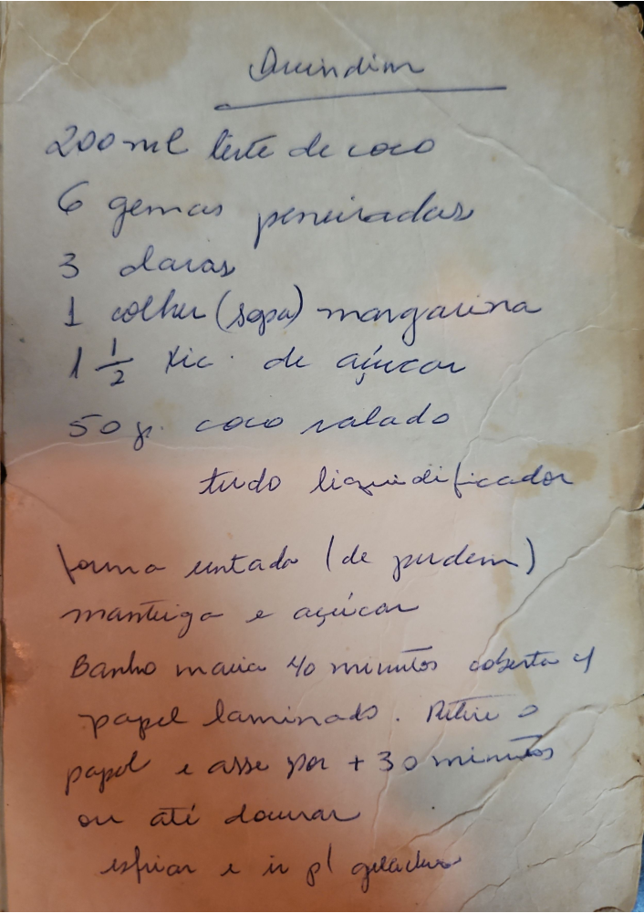

# Página 133
:::danger[NÃO REVISADO]
A página não foi revisada, portanto pode conter erros de digitação, formatação ou alucinações.
:::
## Quindim

*   200 ml leite de coco
*   6 gemas peneiradas
*   3 claras
*   1 colher (sopa) margarina
*   1½ xic. de açúcar
*   50g coco ralado
*   tudo liquidificador

*   forma untada (de pudim)
*   mantiga e açúcar
*   Banho maria 40 minutos coberta c/
*   papel laminado. Retire o
*   papel e asse por + 30 minutos
*   ou até dourar
*   esfriar e ir p/ geladeira

