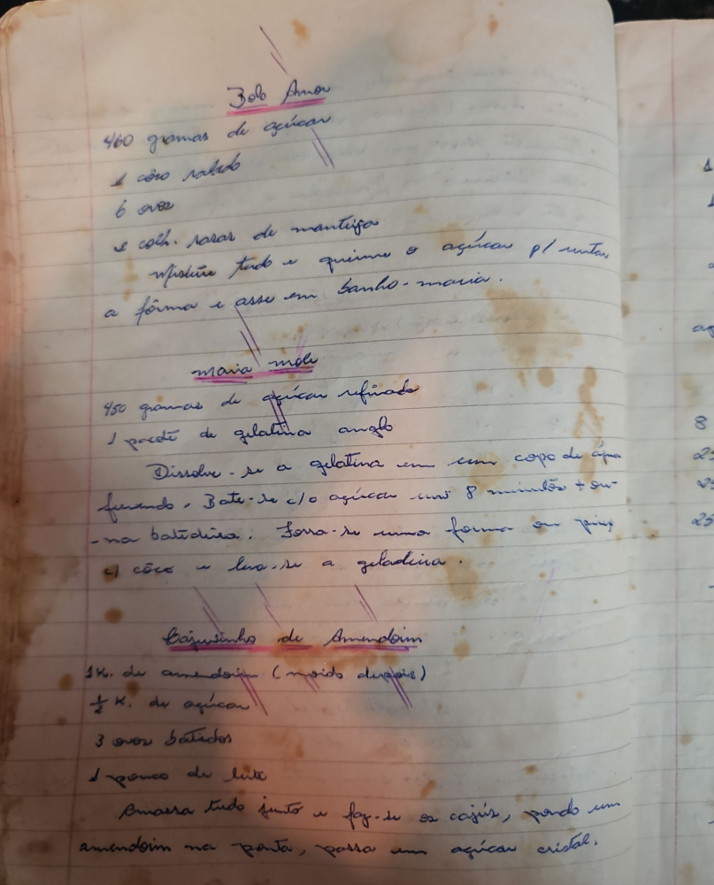

# Página 21
:::danger[NÃO REVISADO]
A página não foi revisada, portanto pode conter erros de digitação, formatação ou alucinações.
:::
## Bob Amou

-   460 gramas de açúcar
-   1 côco ralado
-   6 ovos
-   1 colh. sopa de manteiga

Misture tudo e queime o açúcar p/ untar
a fôrma e asse em banho-maria.

## maia mole

-   450 gramas de açúcar refinado
-   1 pacote de gelatina anglo

Dissolve-se a gelatina em um copo de água
fervendo. Bate-se c/ o açúcar uns 8 minutos + ou-
na batedeira. Forra-se uma forma c/ papel
de cêra e leva-se a geladeira.

## Cajuzinho de Amendoim

-   ¼ K. de amendoim (moido devagar)
-   ½ K. de açúcar
-   3 ovos batidos
-   1 pouco de leite

Amassa tudo junto e faz-se os cajús, põe-se um
amendoim na ponta, passa em açúcar cristal.

