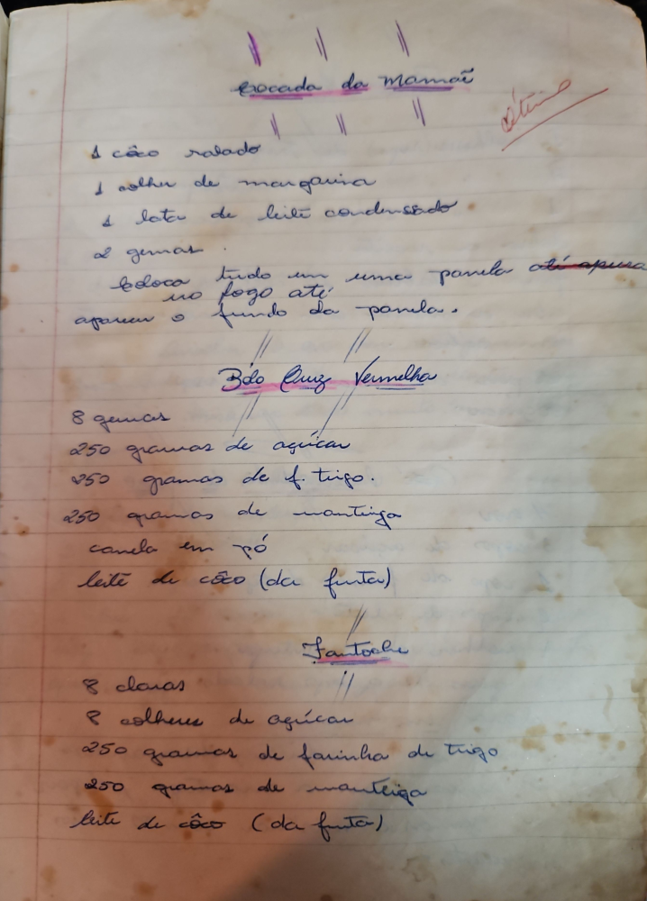

# Página 22
:::danger[NÃO REVISADO]
A página não foi revisada, portanto pode conter erros de digitação, formatação ou alucinações.
:::
## Brocada da Mamãe

- 1 cão ralado
- 1 colher de margarina
- 1 lata de leite condensado
- 2 gemas

Coloca tudo em uma panela vá apenas ao fogo até apurar o fundo da panela.

## Bôlo Cruz Vermelha

- 8 gemas
- 250 gramas de açúcar
- 250 gramas de f. trigo.
- 250 gramas de manteiga
- canela em pó
- leite de côco (da fruta)

## Santoche

- 8 claras
- 8 colheres de açúcar
- 250 gramas de farinha de trigo
- 250 gramas de manteiga
- leite de côco (da fruta)

