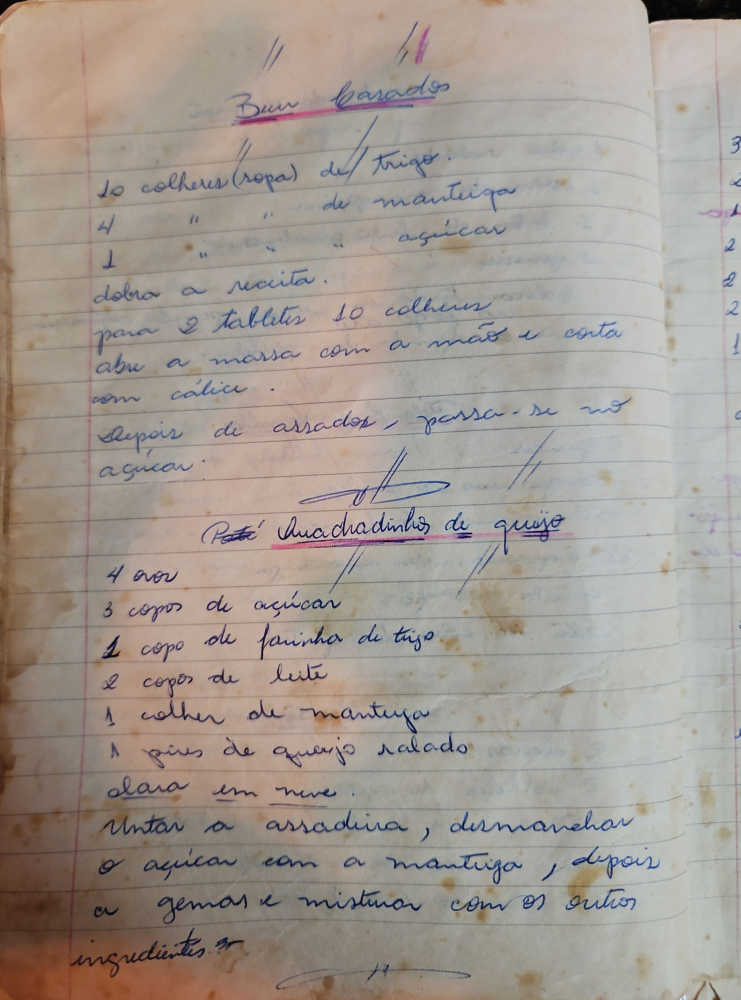

# Página 23
:::danger[NÃO REVISADO]
A página não foi revisada, portanto pode conter erros de digitação, formatação ou alucinações.
:::
## Bum Carados

*   10 colheres (sopa) de trigo
*   4 colheres (sopa) de manteiga
*   1 colher (sopa) de açúcar

dobra a receita.
para 2 tablites 10 colheres
abre a massa com a mão e corta com cálice.
Depois de assados, passa-se no açúcar.

## Patê Quadradinhos de queijo

*   4 ovos
*   3 copos de açúcar
*   1 copo de farinha de trigo
*   2 copos de leite
*   1 colher de manteiga
*   1 pires de queijo ralado
*   clara em neve

Untar a assadeira, desmanchar o açúcar com a manteiga, depois as gemas e misturar com os outros ingredientes.

