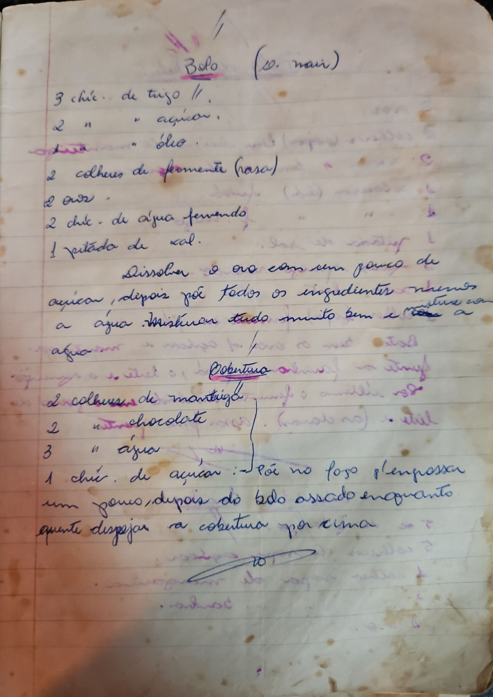

# Página 24
:::danger[NÃO REVISADO]
A página não foi revisada, portanto pode conter erros de digitação, formatação ou alucinações.
:::
## Bolo (S. nair)

- 3 chic. de trigo //
- 2 " " açucar,
- 2 " " óleo.
- 2 colheres de fermente (rasa)
- 2 ovos.
- 2 chic. de agua fervendo
- 1 pitada de sal.

Dissolver o ovo com um pouco de açucar, depois põe todos os ingredientes - Misturar tudo muito bem e metter a assar.

### Cobertura

- 2 colheres de manteiga
- 2 de chocolate
- 3 " água
- 1 chic. de açucar

:Põe no fogo p/ engrossar um pouco, depois do bolo assado enquanto quente despejar a cobertura por cima.

