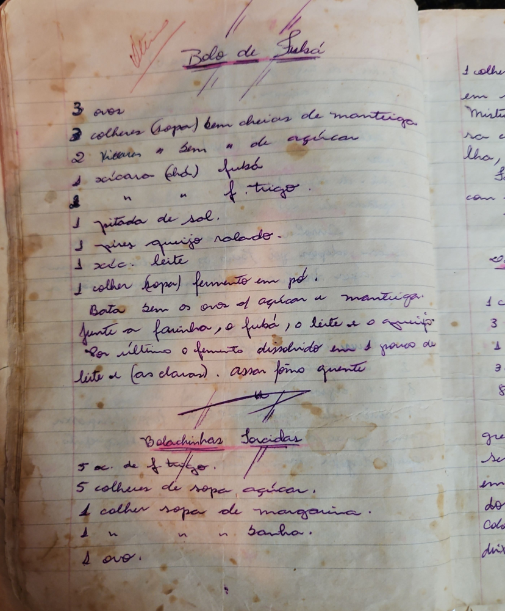

# Página 25
:::danger[NÃO REVISADO]
A página não foi revisada, portanto pode conter erros de digitação, formatação ou alucinações.
:::
## Bolo de Fubá

*   3 ovos
*   3 colheres (sopa) bem cheias de manteiga.
*   2 xícaras " sem " de açúcar
*   1 xícara (chá) fubá
*   " " f. trigo.
*   1 pitada de sal.
*   1 pires queijo ralado.
*   1 xíc. leite
*   1 colher (sopa) fermento em pó!

Bata bem os ovos o\ açúcar e manteiga.
Junte a farinha, o fubá, o leite e o queijo.
Por último o fermento dissolvido em 1 pouco de leite e (as claras). Assar fôrno quente.

## Bolachinhas Sorcidas

*   5 xc. de f trigo.
*   5 colheres de sopa açúcar.
*   1 colher sopa de margarina.
*   1 " " " banha.
*   1 ovo.

