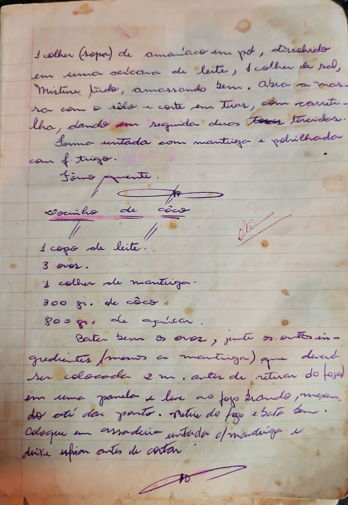

# Página 26
:::danger[NÃO REVISADO]
A página não foi revisada, portanto pode conter erros de digitação, formatação ou alucinações.
:::
1 colher (sopa) de amoniaco em pó, dissolvido
em uma xícara de leite, 1 colher de sal,
Misture tudo, amassando bem. Abra a mas-
sa com o rôlo e corte em tiras, com carreti-
lha, dando em seguida duas torças torcidas.
Fôrma untada com manteiga e polvilhada
com f. trigo.
Fôrno quente.

## Docinho de côco

### Ingredientes

*   1 copo de leite.
*   3 ovos.
*   1 colher de manteiga.
*   300 gr. de côco.
*   800 gr. de açucar.

### Modo de Preparo

*   Bater bem os ovos, junte os outros in-
    gredientes (menos a manteiga) que deverá
    ser colocada 2 m. antes de retirar do fogão
    em uma panela e leve ao fogo brando, mexen-
    do até dar ponto.
*   Retire do fogo e bata bem.
*   Coloque em assadeira untada c/ manteiga e
    deixe esfriar antes de cortar.

