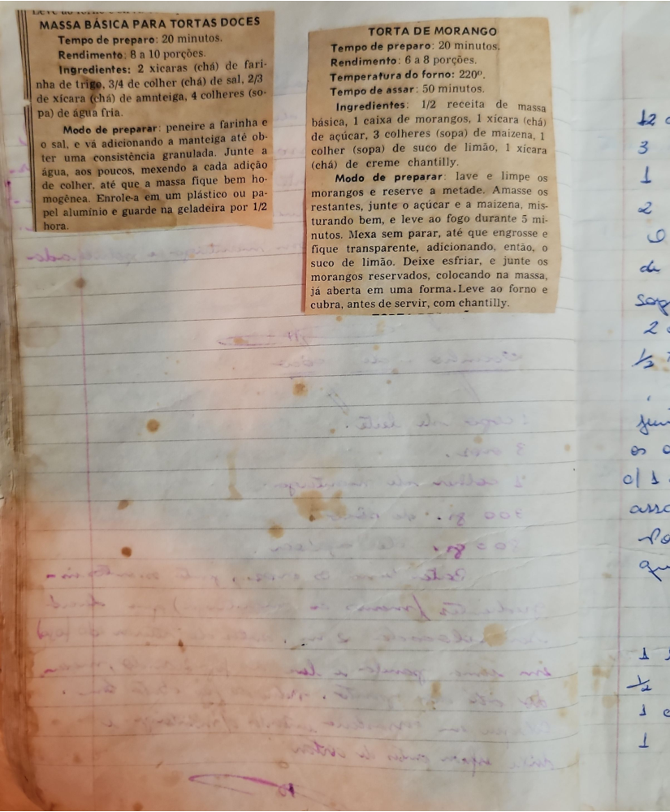

# Página 27
:::danger[NÃO REVISADO]
A página não foi revisada, portanto pode conter erros de digitação, formatação ou alucinações.
:::
## MASSA BÁSICA PARA TORTAS DOCES
Tempo de preparo: 20 minutos.
Rendimento: 8 a 10 porções.
### Ingredientes:
*   2 xícaras (chá) de farinha de trigo.
*   3/4 de colher (chá) de sal.
*   2/3 de xícara (chá) de manteiga.
*   4 colheres (sopa) de água fria.
### Modo de preparar:
1.  Peneire a farinha e o sal, e vá adicionando a manteiga até obter uma consistência granulada.
2.  Junte a água, aos poucos, mexendo a cada adição de colher, até que a massa fique bem homogênea.
3.  Enrole-a em um plástico ou papel alumínio e guarde na geladeira por 1/2 hora.

## TORTA DE MORANGO
Tempo de preparo: 20 minutos.
Rendimento: 6 a 8 porções.
Temperatura do forno: 220º.
Tempo de assar: 50 minutos.
### Ingredientes:
*   1/2 receita de massa básica.
*   1 caixa de morangos.
*   1 xícara (chá) de açúcar.
*   3 colheres (sopa) de maizena.
*   1 colher (sopa) de suco de limão.
*   1 xícara (chá) de creme chantilly.
### Modo de preparar:
1.  lave e limpe os morangos e reserve a metade.
2.  Amasse os restantes, junte o açúcar e a maizena, misturando bem, e leve ao fogo durante 5 minutos.
3.  Mexa sem parar, até que engrosse e fique transparente, adicionando, então, o suco de limão.
4.  Deixe esfriar, e junte os morangos reservados, colocando na massa, já aberta em uma forma.
5.  Leve ao forno e cubra, antes de servir, com chantilly.

