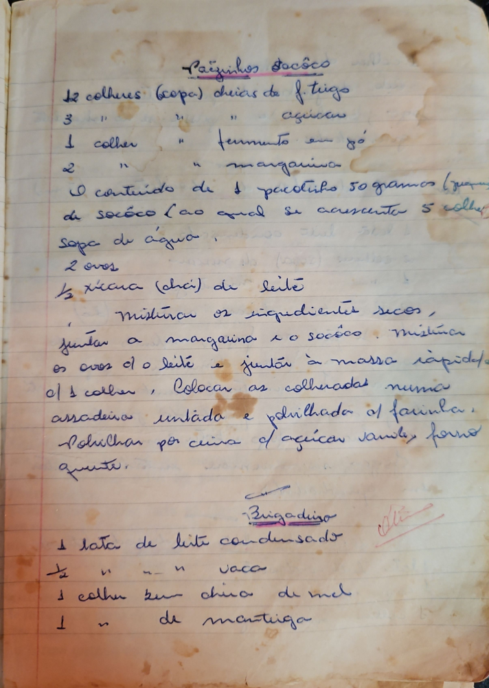

# Página 28
:::danger[NÃO REVISADO]
A página não foi revisada, portanto pode conter erros de digitação, formatação ou alucinações.
:::
## Pãezinhos Socôco

- 12 colheres (sopa) cheias de f. trigo
- 3 " " " açúcar
- 1 colher " " fermento em pó
- 2 " " " margarina
- O conteúdo de 1 pacotinho 50 gramas (qualquer?) de socôco (ao qual se acrescenta 5 colheres) sopa de água,
- 2 ovos
- 1/2 xícara (chá) de leite

Misturar os ingredientes secos, juntar a margarina e o socôco. Misturar os ovos e o leite e juntar à massa rápida o/à colher. Colocar as colheradas numa assadeira untada e polvilhada c/ farinha. Polvilhar por cima c/ açúcar vanille. forno quente.

## Brigadeiro

- 1 lata de leite condensado
- 1/2 " " vaca
- 1 colher bem cheia de mel
- 1 " de manteiga

