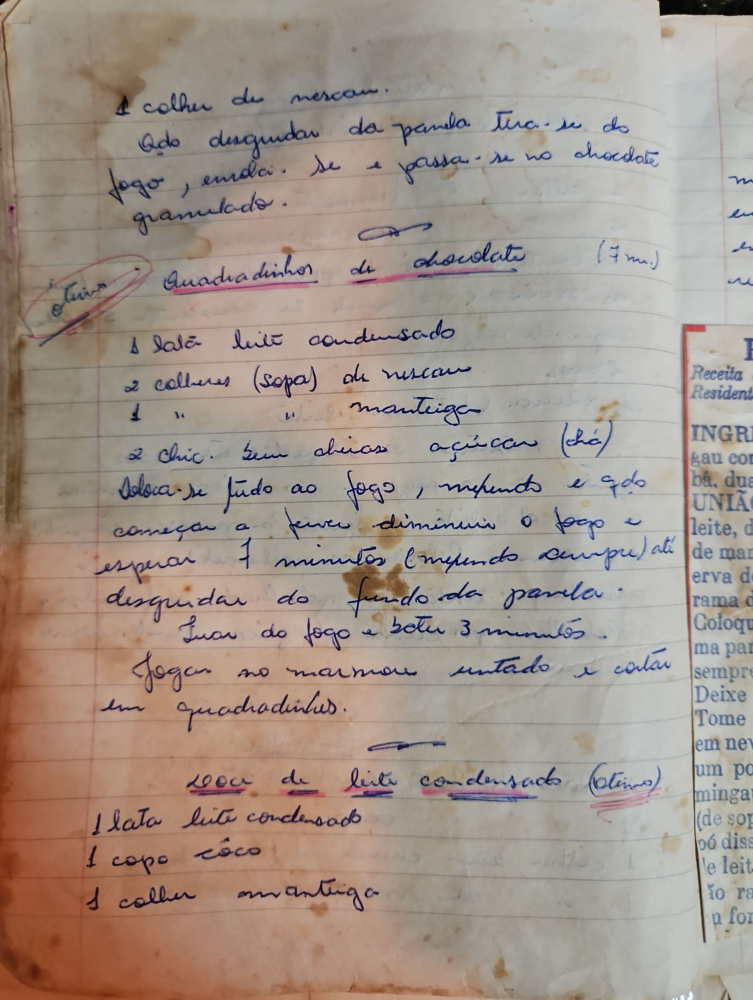

# Página 29
:::danger[NÃO REVISADO]
A página não foi revisada, portanto pode conter erros de digitação, formatação ou alucinações.
:::
## [Sem Título - Doce]

1 colher de nescau.
Qdo desgrudar da panela tira-se do fogo, embrula-se e passa-se no chocolate granulado.

## Quadradinhos de chocolate (7 m.) (Otimo)

*   1 lata leite condensado
*   2 colheres (sopa) de nescau
*   1 " " manteiga
*   2 chic. bem cheias açúcar (chá)

Coloca-se tudo ao fogo, mexendo até começar a ferver diminuir o fogo e esperar 7 minutos (mexendo sempre) até desgrudar do fundo da panela.
Tirar do fogo e bater 3 minutos.
Jogar no marmore untado e cortar em quadradinhos.

~~200cc de leite condensado (Otimo)~~

*   1 lata leite condensado
*   1 copo côco
*   1 colher manteiga

