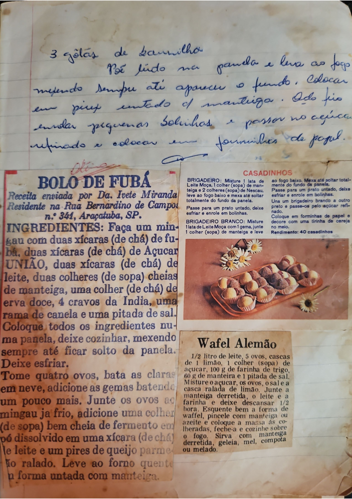

# Página 30
:::danger[NÃO REVISADO]
A página não foi revisada, portanto pode conter erros de digitação, formatação ou alucinações.
:::
## Notas Manuscritas
*   3 gôlas de bannilha
*   Põe tudo na panela e leva ao fogo mexendo sempre até apareceu o fundo.
*   Colocar em piux untado d mantiga.
*   Isto frio endar pequenhas bolinhas e passar no acúcar refinado e colocar em forminhas de papel.

## BOLÔ DE FUBÁ
### Receita enviada por Da. Ivete Miranda
Residente na Rua Bernardino de Campos n.º 341, Araçatuba, SP.
### INGREDIENTES:
Faça um mingau com:
*   duas xícaras (de chá) de fubá,
*   duas xícaras (de chá) de Açucar UNIÃO,
*   duas xícaras (de chá) de leite,
*   duas colheres (de sopa) cheias de manteiga,
*   uma colher (de chá) de erva doce,
*   4 cravos da India,
*   uma rama de canela e uma pitada de sal.
### Modo de Preparo:
*   Coloque todos os ingredientes numa panela, deixe cozinhar, mexendo sempre até ficar solto da panela.
*   Deixe esfriar.
*   Tome quatro ovos, bata as claras em neve, adicione as gemas batendo um pouco mais.
*   Jun-te os ovos ao mingau ja frio, adicione uma colher (de sopa) bem cheia de fermento em pó dissolvido em uma xícara (de chá) de leite e um pires de queijo parme-são ralado.
*   Leve ao forno quente em forma untada com manteiga.

## CASADINHOS
### BRIGADEIRO:
*   Misture 1 lata de Leite Moça, 1 colher (sopa) de manteiga e 2 colheres (sopa) de Nescau.
*   Leve ao fogo baixo e mexa até soltar totalmente do fundo da panela.
*   Passe para um prato untado, deixe esfriar e enrole em bolinhas.
### BRIGADEIRO BRANCO:
*   Misture 1 lata de Leite Moça com 1 gema, junto 1 colher (sopa) de manteiga e leve ao fogo baixo.
*   Mexa até soltar totalmente do fundo da panela.
*   Una um brigadeiro branco a outro preto e passe-os pelo açúcar refinado.
*   Coloque em forminhas de papel e decore com uma tirinha de cereja no meio.
### Rendimento:
*   40 casadinhos

## WAFEL Alemão
### Ingredientes:
*   1/2 litro de leite,
*   5 ovos,
*   cascas de 1 limão,
*   1 colher (sopa) de açúcar,
*   100 g de farinha de trigo,
*   60 g de manteiga
*   e 1 pitada de sal.
### Modo de Preparo:
*   Misture o açúcar, os ovos, o sal e a casca ralada de limão.
*   Junte a manteiga derretida, o leite e a farinha e deixe descansar 1/2 hora.
*   Esquente bem a forma de waffel, pincele com manteiga derretida e coloque a massa às colheradas, feche-a e cozinhe sobre o fogo.
*   Sirva com manteiga derretida, geléia, mel, compota ou melado.

