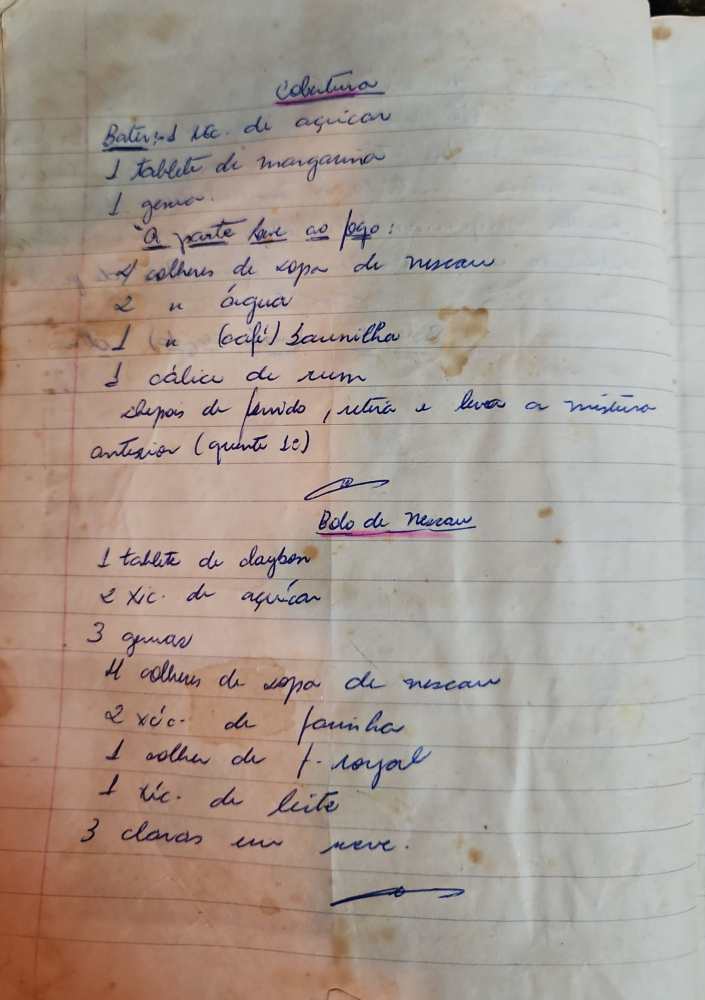

# Página 31
:::danger[NÃO REVISADO]
A página não foi revisada, portanto pode conter erros de digitação, formatação ou alucinações.
:::
## Cobertura

- Bater:
    - 1 xíc. de açúcar
    - 1 tablete de margarina
    - 1 gema.
- À parte leve ao fogo:
    - 4 colheres de sopa de nescau
    - 2 u água
    - 1 (de café) baunilha
    - 1 cálice de rum
- depois de fervido, retira e leva a mistura anterior (quente sc)

## Bolo de Nescau

- 1 tablete de claybon
- 2 xíc. de açúcar
- 3 gemas
- 4 colheres de sopa de nescau
- 2 xíc. de farinha
- 1 colher de f. royal
- 1 xíc. de leite
- 3 claras em neve.

