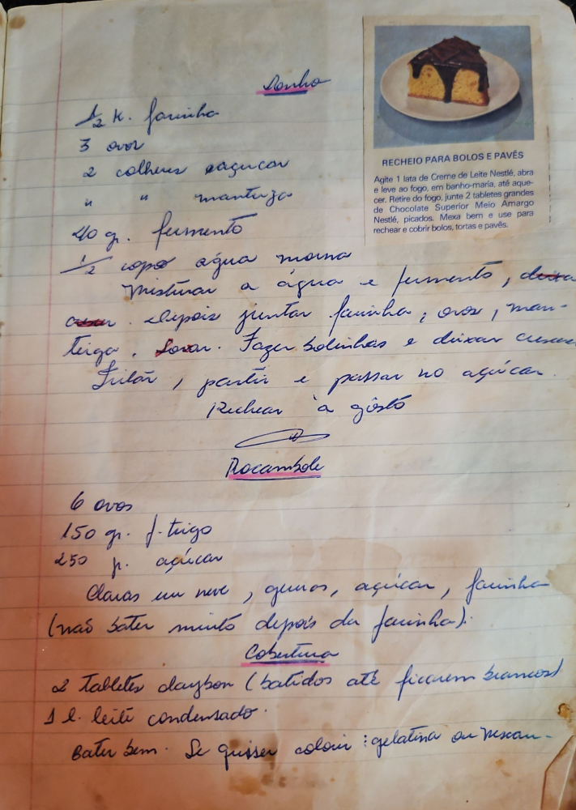

# Página 32
:::danger[NÃO REVISADO]
A página não foi revisada, portanto pode conter erros de digitação, formatação ou alucinações.
:::
## Sonho

*   ½ K. farinha
*   3 ovos
*   2 colheres açucar
*   "      "      manteiga
*   40 g. fermento
*   ½ copo água morna

Misturar a água e fermento, deixar crescer. Depois juntar farinha, ovos, manteiga. Sovar. Fazer bolinhas e deixar crescer. Fritar, partir e passar no açúcar. Rechear a gosto.

## RECHEIO PARA BOLOS E PAVÊS

Agite 1 lata de Creme de Leite Nestlé, abra e leve ao fogo, em banho-maria, até aquecer. Retire do fogo, junte 2 tabletes grandes de Chocolate Superior Meio Amargo Nestlé, picados. Mexa bem e use para rechear e cobrir bolos, tortas e pavês.

## Rocambole

*   6 ovos
*   150 gr. f. trigo
*   250 gr. açúcar

Claras em neve, gemas, açucar, farinha (não bater muito depois da farinha).

## Cobertura

*   2 Tabletes "Claybon" (batidos até ficarem brancos)
*   1 L. leite condensado.

Bater bem. Se quisser colorir: gelatina ou nesca-.

