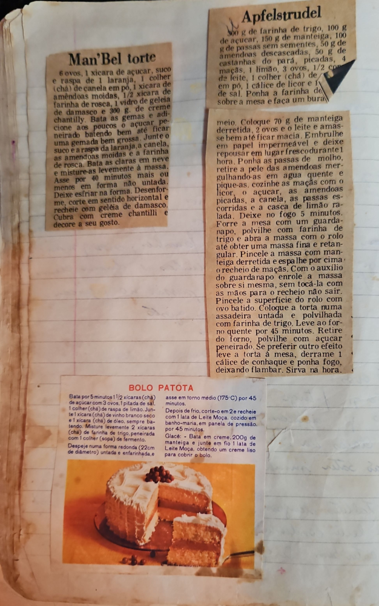

# Página 33
:::danger[NÃO REVISADO]
A página não foi revisada, portanto pode conter erros de digitação, formatação ou alucinações.
:::
## Man'Bel torta

*   6 ovos, 1 xicara de açucar, suco e raspa de 1 laranja, 1 colher (chá) de canela em pó, 1 xicara de amêndoas moídas, 1/2 xicara de farinha de rosca, 1 vidro de geleia de damasco e 300 g. de creme chantilly.
*   Bata as gemas e adicione aos poucos o açucar peneirado batendo bem até ficar uma gemada bem grossa.
*   Junte o suco e a raspa da laranja, a canela, as amendoas moídas e a farinha de rosca.
*   Bata as claras em neve e misture-as levemente à massa.
*   Asse por 40 minutos ou menos em forma não untada.
*   Deixe esfriar na forma.
*   Desenforme, corte em sentido horizontal e recheie com geleia de damasco.
*   Cubra com creme chantilli e decore a seu gosto.

## Apfelstrudel

*   300 g de farinha de trigo, 100 g de açucar, 150 g de manteiga, 100 g de passas sem sementes, 50 g de amendoas descascadas, 50 g de castanhas do pará picadas, 4 maçãs, 1 limão, 3 ovos, 1/2 copo de leite, 1 colher (chá) de canela em pó, 1 cálice de licor e 1 pitada de sal.
*   Ponha a farinha de trigo sobre a mesa e faça um buraquinho no meio.
*   Coloque 70 g de manteiga derretida, 2 ovos e o leite e amasse bem até ficar macia.
*   Embrulhe em papel impermeável e deixe repousar em lugar fresco durante 1 hora.
*   Ponha as passas de molho, retire a pele das amendoas mergulhando-as em agua quente e pique-as.
*   cozinhe as maçãs com o licor, o açucar, as amendoas picadas, a canela, as passas escorridas e a casca de limão ralada.
*   Deixe no fogo 5 minutos.
*   Forre a mesa com um guarda-napo, polvilhe com farinha de trigo e abra a massa com o rolo até obter uma massa fina e retangular.
*   Pincele a massa com manteiga derretida e espalhe por cima o recheio de maçãs.
*   Com o auxilio do guardanapo enrole a massa sobre si mesma, sem tocá-la com as mãos para o recheio não sair.
*   Pincele a superficie do rolo com ovo batido.
*   Coloque a torta numa assadeira untada e polvilhada com farinha de trigo.
*   Leve ao forno quente por 45 minutos.
*   Retire do forno, polvilhe com açucar peneirado. Se preferir outro efeito leve a torta à mesa, derrame 1 cálice de conhaque e ponha fogo, deixando flambar. Sirva na hora.

## BOLO PATOTA

*   Bata por 5 minutos 1 1/2 xicaras (chá) de açucar com 3 ovos, 1 pitada de sal, 1 colher (chá) de raspa de limão.
*   Junte 1 xicara (chá) de vinho branco seco e 1 xicara (chá) de óleo, sempre batendo.
*   Misture levemente 2 xicaras (chá) de farinha de trigo, peneirada com 1 colher (sopa) de fermento.
*   Despeje numa forma redonda (22cm de diâmetro) untada e enfarinhada, e asse em torno médio (175 C) por 45 minutos.
*   Depois de frio, corte-o em 2 e recheie com 1 lata de Leite Moça cozido em banho-maria, em panela de pressão, por 45 minutos.

### Glacê

*   Bata em creme, 200g de manteiga e junte em fio 1 lata de Leite Moça, obtendo um creme liso para cobrir o bolo.

