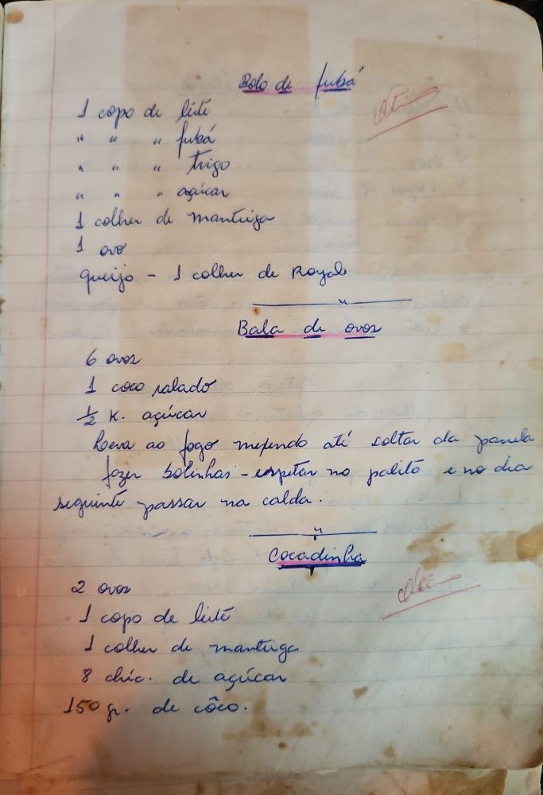

# Página 34
:::danger[NÃO REVISADO]
A página não foi revisada, portanto pode conter erros de digitação, formatação ou alucinações.
:::
## Bolo de fubá

- 1 copo de leite
- " " " fubá
- " " " trigo
- " " " açúcar
- 1 colher de manteiga
- 1 ovo
- queijo - 1 colher de Royal

## Bala de ovos

- 6 ovos
- 1 coco ralado
- ½ K. açúcar
- Levar ao fogo mexendo até soltar da panela
- fazer bolinhas - espetar no palito e no dia seguinte passar na calda.

## Cocadinha

- 2 ovos
- 1 copo de leite
- 1 colher de manteiga
- 8 chic. de açúcar
- 150 gr. de côco.

