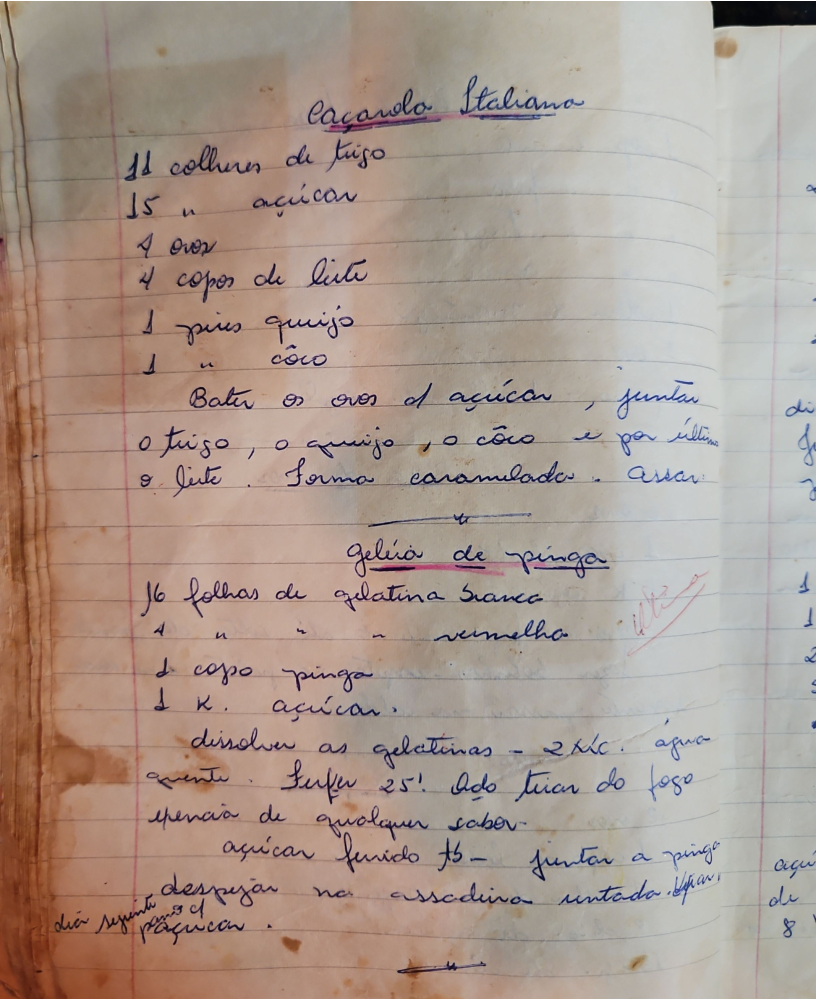

# Página 35
:::danger[NÃO REVISADO]
A página não foi revisada, portanto pode conter erros de digitação, formatação ou alucinações.
:::
## Pagarolo Italiana

*   11 colheres de frijo
*   15 " açucar
*   4 ovos
*   4 copos de leite
*   1 pires queijo
*   1 " coco

Bater os ovos e o açucar, juntar o frijo, o queijo, o côco e por último o leite. Forma caramelada. Assar.

## geléia de pinga

*   16 folhas de gelatina branca
*   4 " " " vermelha
*   1 copo pinga
*   1 K. açucar.

*   dissolver as gelatinas - 2 Lt. água quente.
*   Sufar 25! dedo tirar do fogo
*   apencia de qualquer sabor
*   açucar fervido
*   juntar a pinga
*   despejar na assadeira untada. deixar dia seguin de paquicar.

