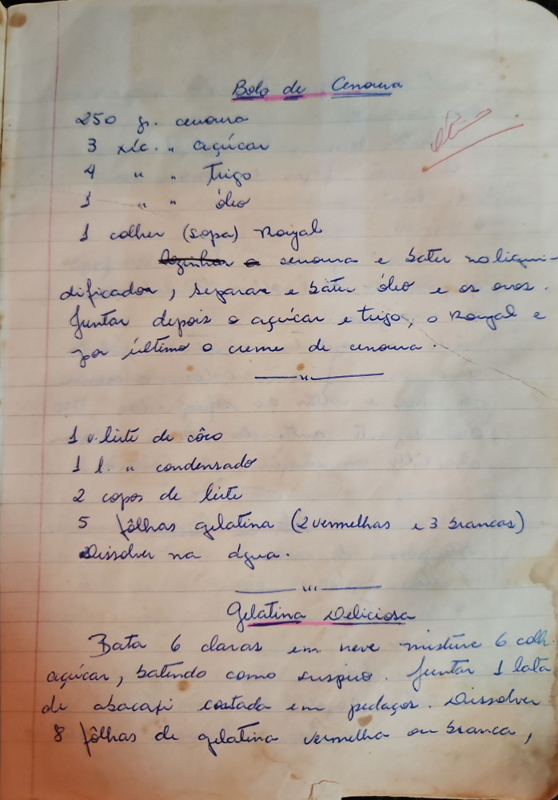

# Página 36
:::danger[NÃO REVISADO]
A página não foi revisada, portanto pode conter erros de digitação, formatação ou alucinações.
:::
## Bolo de Cenoura

*   250 gr. cenoura
*   3 xc. " açúcar
*   4 " " Trigo
*   1 " " óleo
*   1 colher (sopa) Royal

Desmanchar a cenoura e bater no liqui-
dificador, separar e bater óleo e os ovos.
Juntar depois o açúcar e trigo, o Royal e
por último o creme de cenoura.
---

*   1 vl. leite de côco
*   1 l. " condensado
*   2 copos de leite
*   5 fôlhas gelatina (2 vermelhas e 3 brancas)
Dissolva na agua.
---

### Gelatina Deliciosa

Bata 6 claras em neve misture 6 coll.
açúcar, batendo como suspiro. Juntar 1 lata
de abacaxi cortada em pedaços. Dissolver
8 fôlhas de gelatina vermelha ou branca,

