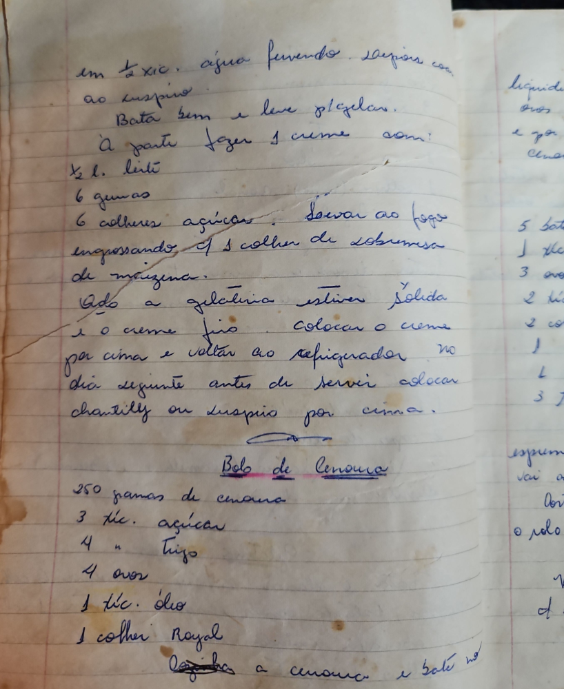

# Página 37
:::danger[NÃO REVISADO]
A página não foi revisada, portanto pode conter erros de digitação, formatação ou alucinações.
:::
## Gelatina com Creme

em ½ xíc. água fervendo derreter con
ao suspiro.
Bata bem e leve à geladeira.
À parte fazer 1 creme com:
* ½ l. leite
* 6 gemas
* 6 colheres açúcar. Levar ao fogo
engrossando c/ 1 colher de sobremesa
de maizena.
Qdo a gelatina estiver sólida
e o creme frio colocar o creme
por cima e voltar ao refrigerador. No
dia seguinte antes de servir colocar
chantilly ou suspiro por cima.

## Bolo de Cenoura

* 250 gramas de cenoura
* 3 xíc. açúcar
* 4 " Trigo
* 4 ovos
* 1 xíc. óleo
* 1 colher Royal

Descascar a cenoura e bater no

