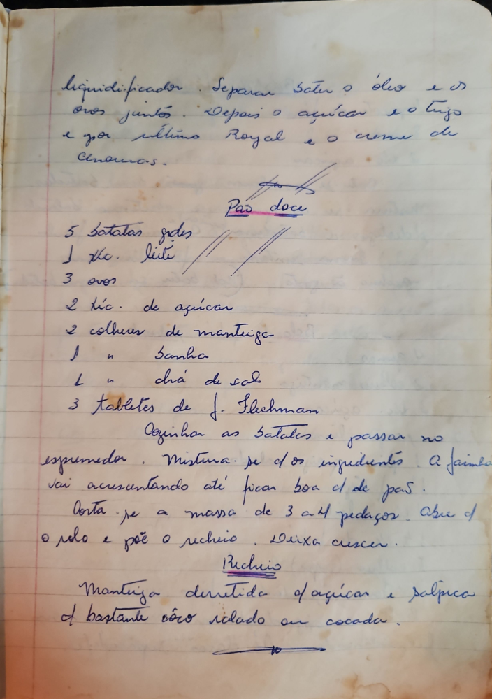

# Página 38
:::danger[NÃO REVISADO]
A página não foi revisada, portanto pode conter erros de digitação, formatação ou alucinações.
:::

liquidificador. Separar bater o óleo e os
ovos juntos. Depois o açucar e o trigo
e por ultimo Royal e o creme de
Amendoas.

## Pão doce

* 5 batatas gdes
* 1 xic. leite
* 3 ovos
* 2 xic. de açucar
* 2 colhers de manteiga
* 1 " banha
* 1 " chá de sal
* 3 tabletes de J. Flechman

Cozinha as batatas e passar no
espremedor. Mistura-se c/ os ingredientes. A farinha
vai acrescentando até ficar boa p/ de pão.

Corta-se a massa de 3 a 4 pedaços. Abre c/
o rolo e põe o recheio. Deixa crescer.

### Recheio

Manteiga derretida c/ açucar e polpica
c/ bastante côco ralado ou cocada.

