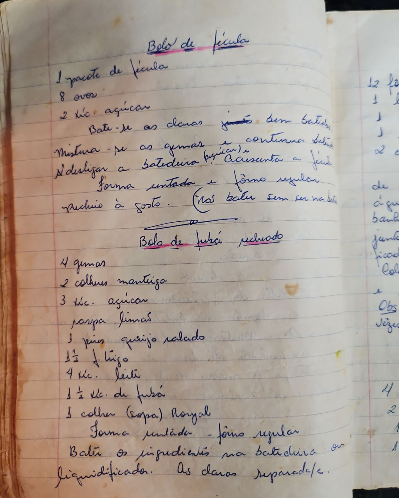

# Página 39
:::danger[NÃO REVISADO]
A página não foi revisada, portanto pode conter erros de digitação, formatação ou alucinações.
:::
## Bolo de fécula

- 1 pacote de fécula
- 8 ovos
- 2 xíc. açúcar
- Bate-se as claras junto sem batida
- Mistura-se as gemas e continua batendo
- N desligar a batedeira, e acrescenta a fécula
- Forma untada e fôrno regular
- prechio a gosto. (Não bater sem ser na bate)

## Bolo de fubá pechado

- 4 gemas
- 2 colheres manteiga
- 3 xíc. açúcar
- caspa Limão
- 1 pires queijo ralado
- 1½ f trigo
- 4 xíc. leite
- 1 ½ xíc. de fubá
- 1 colher (sopa) Royal
- Forma untada - fôrno regular
- Bater os ingredientes na batedeira ou Liquidificador. As claras separada/s.

