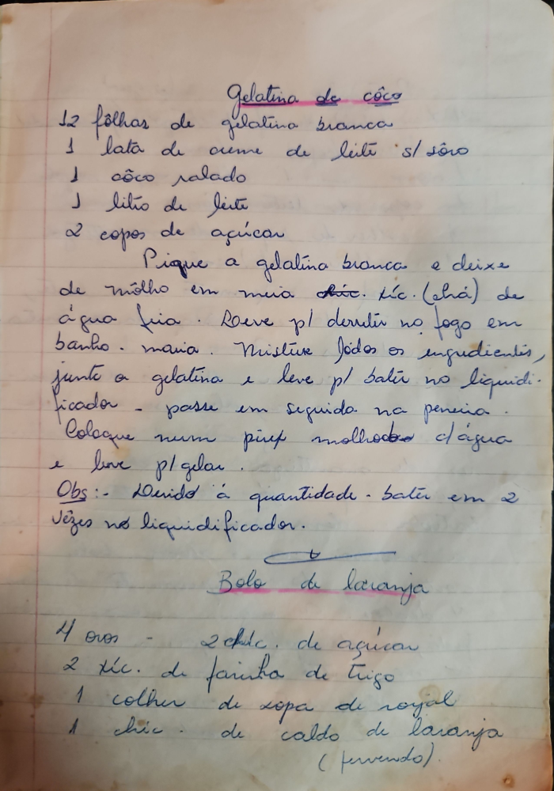

# Página 40
:::danger[NÃO REVISADO]
A página não foi revisada, portanto pode conter erros de digitação, formatação ou alucinações.
:::
## Gelatina de côco

- 12 fôlhas de gelatina branca
- 1 lata de creme de leite s/ sôro
- 1 côco ralado
- 1 litro de leite
- 2 copos de açucar

Pique a gelatina branca e deixe
de môlho em meia chíc. (chá) de
água fria. Leve p/ derreter no fogo em
banho-maria. Misture todos os ingredientes,
junte a gelatina e leve p/ bater no liquidi-
ficador - passe em seguida na peneira.
Coloque num pirex molhado c/água
e leve p/ gelar.
Obs.: Devido á quantidade - bater em 2
vêzes no liquidificador.

## Bolo de laranja

- 4 ovos
- 2 chíc. de açucar
- 2 chíc. de farinha de trigo
- 1 colher de sopa de royal
- 1 chíc. de caldo de laranja
( fervendo).

