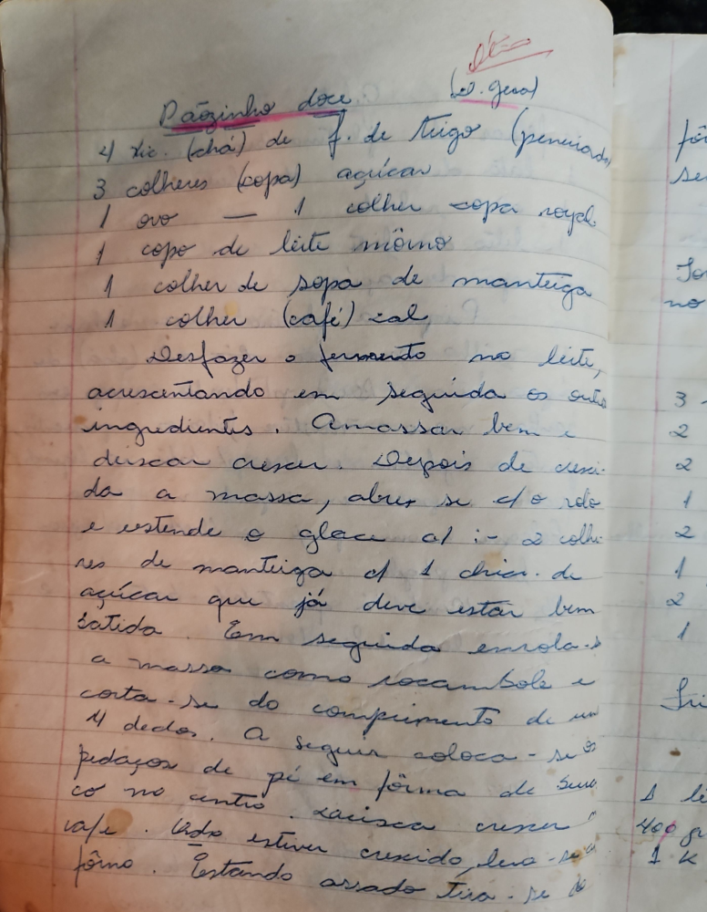

# Página 41
:::danger[NÃO REVISADO]
A página não foi revisada, portanto pode conter erros de digitação, formatação ou alucinações.
:::
## Paozinho doce (Leve, gost.)

### Ingredientes

*   4 xc. (chá) de f. de trigo (peneirada)
*   3 colheres (sopa) açucar
*   1 ovo - 1 colher sopa royal
*   1 copo de leite mórno
*   1 colher de sopa de manteiga
*   1 colher (café) sal

### Modo de Preparo

Desfazer o fermento no leite, acrescentando em seguida os outros ingredientes. Amassar bem e deixar crescer. Depois de crescida a massa, abrir se c/ o rolo e estende o glace c/ :- 2 colheres de manteiga e 1 xicar. de açucar que já deve estar bem batida. Em seguida enrola-se a massa como rocambole e corta-se do comprimento de uns 4 dedos. A seguir coloca-se os pedaços de pé em forma de Suecos no outro. Deixar crescer cafe. Quando estiver crescido, leva-se ao fôrno. Estando assado tira-se de.

