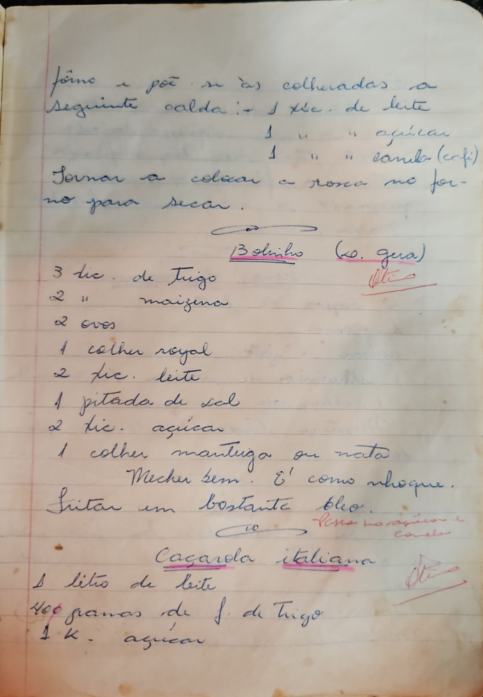

# Página 42
:::danger[NÃO REVISADO]
A página não foi revisada, portanto pode conter erros de digitação, formatação ou alucinações.
:::
## Instruções Anteriores/Notas

forno a poz se às colheradas a Seguinte calda: 1 xíc. de leite
1 " " açúcar
1 " " canela (coff)
Tornar a colocar a rosna no for- no para secar.

## Bolinbo (Co. gera)

- 3 lic. de Trigo
- 2 " maizena
- 2 ovos
- 1 colher royal
- 2 xic. leite
- 1 pitada de sal
- 2 xic. açúcar
- 1 colher mantiga ou nota

Mecher bem. É' como whoque.
Fritar em bastante oleo.
Passa no açucar e canela.

## Caçarola italiana

- 1 litio de leite
- 400 grarias de f. de Trigo
- 1 K. açúcar

