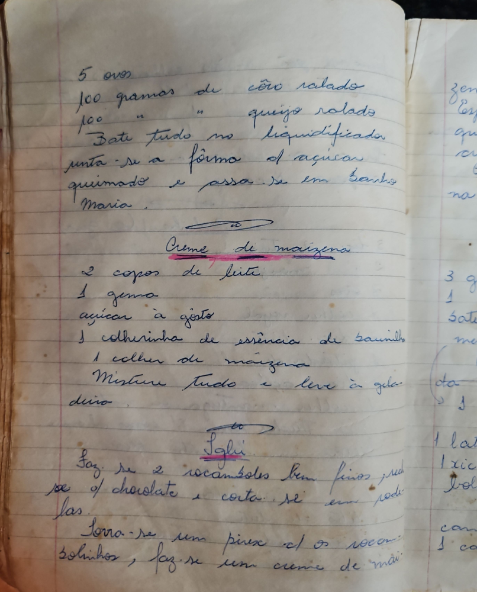

# Página 43
:::danger[NÃO REVISADO]
A página não foi revisada, portanto pode conter erros de digitação, formatação ou alucinações.
:::
* 5 ovos
* 100 gramas de côco ralado
* 100 gramas de queijo ralado

Bate tudo no liquidificador, unta-se a forma o açucar queimado e passa-se em banho Maria.

## Creme de maizena

* 2 copos de leite
* 1 gema
* açúcar à gosto
* 1 colherinha de essência de baunilha
* 1 colher de maizena

Misture tudo e leve à gelar. duro.

## Sagli

Faz-se 2 rocamboles bem finos recheados de chocolate e corta-se em rodelas.
Forra-se um pirex com os rocambolinhos, faz-se um creme de maizena...

