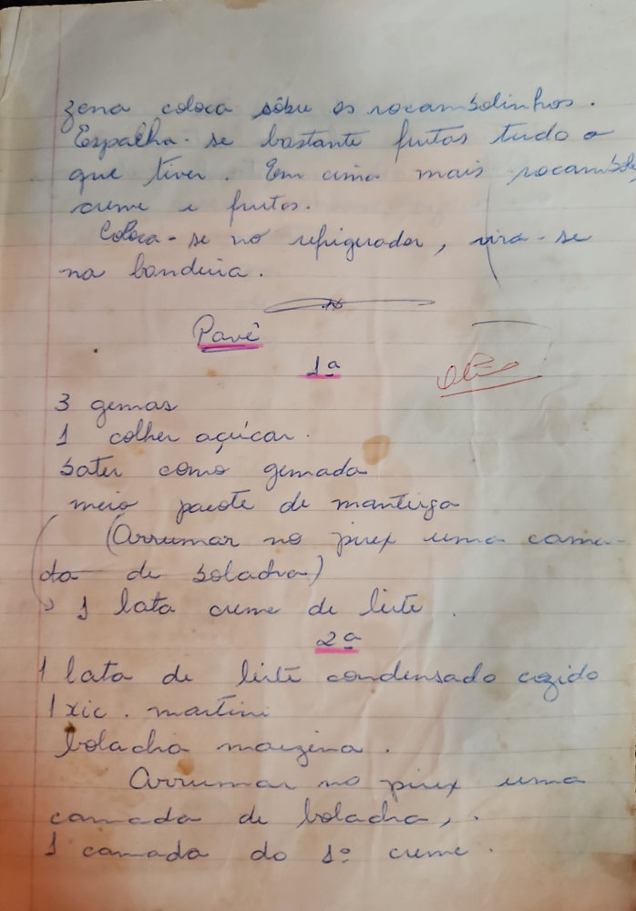

# Página 44
:::danger[NÃO REVISADO]
A página não foi revisada, portanto pode conter erros de digitação, formatação ou alucinações.
:::
Zena coloca sôbre os rocambolinhos.
Espalha-se bastante frutos tudo o
que tiver. Em cima mais rocambolinhos,
creme e frutos.
Coloca-se no refrigerador, vira-se
na bandeija.

## Pavê

### 1ª

-   3 gemas
-   1 colher açucar.
-   Bater como gemada
-   meio pacote de manteiga
-   (Arrumar no pirex uma cama-
-   da de bolacha)
-   1 lata creme de leite

### 2ª

-   1 lata de leite condensado cozido
-   1 xíc . martini
-   Bolacha maizena .
-   Arrumar no pirex uma
-   camada de bolacha,
-   1 camada do 1º creme .

