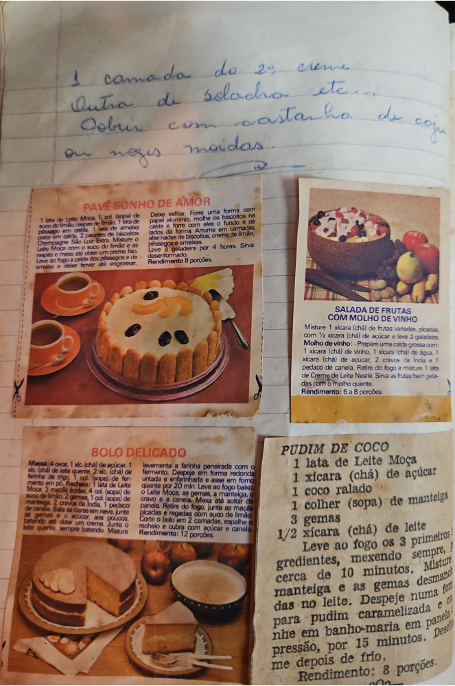

# Página 45
:::danger[NÃO REVISADO]
A página não foi revisada, portanto pode conter erros de digitação, formatação ou alucinações.
:::
## Anotação Manuscrita

*   1 camada do 2º creme
*   Outra de bolacha etc...
*   Cobrir com castanha de caju
*   ou nozes moidas.

## PAVÊ SONHO DE AMOR

*   1 lata de Leite Moça, 5 col. (sopa) de suco de limão, raspas de limão, 1 lata de pêssego em calda, 1 lata de ameixa preta em calda, 2 pacotes de biscoitos Champagne São Luiz Extra.
*   Misture o Leite Moça com o suco do limão e as raspas e mexa até obter um creme liso.
*   Leve ao fogo a calda dos pêssegos e da ameixa e deixe ferver até engrossar. Deixe esfriar.
*   Forre uma forma com papel alumínio, molhe os biscoitos na calda e forre com eles o fundo e os lados da forma.
*   Arrume em camadas alternadas de biscoitos, creme de limão, pêssegos e ameixas.
*   Leve à geladeira por 4 horas.
*   Sirva desenformado.
*   Rendimento: 8 porções.

## SALADA DE FRUTAS COM MOLHO DE VINHO

*   Misture 1 xícara (chá) de frutas variadas, picadas, com ½ xícara (chá) de açúcar e leve à geladeira.
*   Molho de vinho:
    *   Prepare uma calda grossa com: 1 xícara (chá) de vinho, 1 xícara (chá) de água, 1 xícara (chá) de açúcar, 2 cravos da Índia e 1 pedaço de canela.
*   Retire do fogo e misture 1 lata de Creme de Leite Nestlé.
*   Sirva as frutas bem geladas com o molho quente.
*   Rendimento: 6 a 8 porções.

## BOLO DELICADO

*   Massa: 4 ovos, 1 xic. (chá) de açúcar, 1 xíc. (chá) de leite quente, 2 xic. (chá) de farinha de trigo, 1 col. (sopa) de fermento em pó.
*   Recheio: 1 lata de Leite Moça, 3 maçãs ácidas, 4 col. (sopa) de suco de limão, 2 gemas, 1 col. (sopa) de manteiga, 2 cravos da Índia, 1 pedaço de canela.
*   Bata as claras em neve, junte as gemas e o açúcar, aos poucos, batendo até obter um creme.
*   Junte o leite quente, sempre batendo.
*   Misture levemente a farinha peneirada com o fermento.
*   Despeje em forma redonda untada e enfarinhada e asse em forno quente por 20 min.
*   Leve ao fogo baixo o Leite Moça, as gemas, a manteiga, o cravo e a canela.
*   Mexa até soltar da panela.
*   Retire do fogo, junte as maçãs picadas e regadas com suco de limão.
*   Corte o bolo em 2 camadas, espalhe o recheio e cubra com açúcar e canela.
*   Rendimento: 12 porções.

## PUDIM DE COCO

*   1 lata de Leite Moça
*   1 xícara (chá) de açúcar
*   1 coco ralado
*   1 colher (sopa) de manteiga
*   3 gemas
*   1/2 xícara (chá) de leite
*   Leve ao fogo os 3 primeiros gredientes, mexendo sempre, cerca de 10 minutos.
*   Misture a manteiga e as gemas desmanchadas no leite.
*   Despeje numa forma para pudim caramelizada e cozinhe em banho-maria em panela de pressão, por 15 minutos.
*   Desenforme depois de frio.
*   Rendimento: 8 porções.

