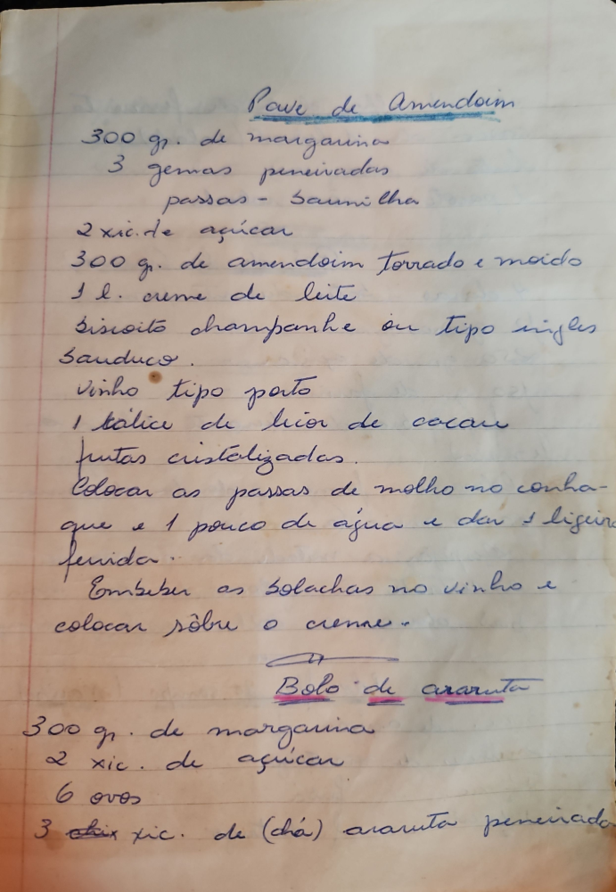

# Página 46
:::danger[NÃO REVISADO]
A página não foi revisada, portanto pode conter erros de digitação, formatação ou alucinações.
:::
## Pave de Amendoim

*   300 gr. de margarina
*   3 gemas peneiradas
*   passas - Baunilha
*   2 xic. de açúcar
*   300 g. de amendoim torrado e moído
*   1 l. creme de leite
*   Biscoito champanhe ou tipo ingles Sanduco.
*   Vinho tipo porto
*   1 talice de licor de cacau
*   frutas cristalizadas.

Colocar as passas de molho no conhaque e 1 pouco de agua e dar 1 ligeira fervida.
Embeber as bolachas no vinho e colocar sôbre o creme.

## Bolo de araruta

*   300 gr. de margarina
*   2 xic. de açucar
*   6 ovos
*   3 (chá) xic. de (chá) araruta peneirada.

