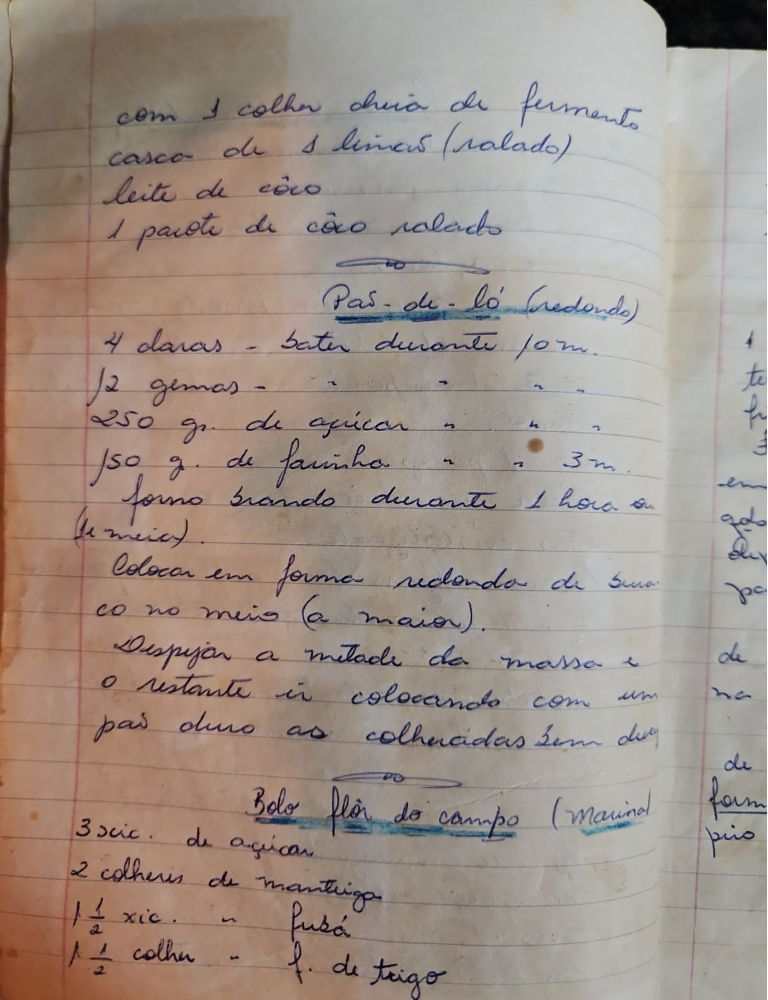

# Página 47
:::danger[NÃO REVISADO]
A página não foi revisada, portanto pode conter erros de digitação, formatação ou alucinações.
:::
*   com 1 colher cheia de fermento
*   casca de 1 limao (ralado)
*   leite de coco
*   1 pacote de côco ralado

## Pão-de-ló (redondo)

*   4 claras - bater durante 10 m.
*   12 gemas - " " " "
*   250 gr. de açucar - " " " "
*   150 gr. de farinha - " " " 3 m.
*   forno brando durante 1 hora ou 1h 30 min.

Colocar em forma redonda de buraco no meio (a maior).
Despejar a metade da massa e o restante ir colocando com um pas duro as colheradas sem desmanchar.

## Bolo flôr do campo (Marinad)

*   3 xic. de açucar
*   2 colheres de manteiga
*   1 1/2 xic. - fusá
*   1 1/2 colher - f. de trigo

