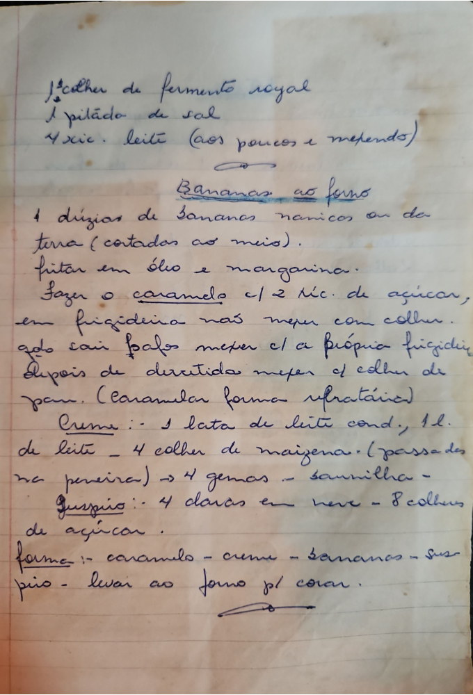

# Página 48
:::danger[NÃO REVISADO]
A página não foi revisada, portanto pode conter erros de digitação, formatação ou alucinações.
:::
```markdown
## [Título da receita incompleta]

*   1 colher de fermento royal
*   1 pitada de sal
*   4 xic. leite (aos poucos e mexendo)

### Bananas ao forno

*   1 duzias de bananas nanicas ou de terra (cortadas ao meio).
*   fritar em óleo e margarina.
*   Fazer o caramelo c/ 2 xic. de açúcar, em frigideira não mexer com colher.
*   qdo sair bolhas mexer c/ a própria frigideira
*   Depois de derretido mexer c/ colher de pau. (Caramelar forma refratária)

### Creme

*   1 lata de leite cond.
*   1l. de leite
*   4 colher de maizena. (passar des na peneira)
*   4 gemas - baunilha -

### Suspiro

*   4 claras em neve
*   8 colheres de açúcar.

### Montagem

*   forma: caramelo - creme - bananas - suspiro
*   levar ao forno p/ corar.
```

