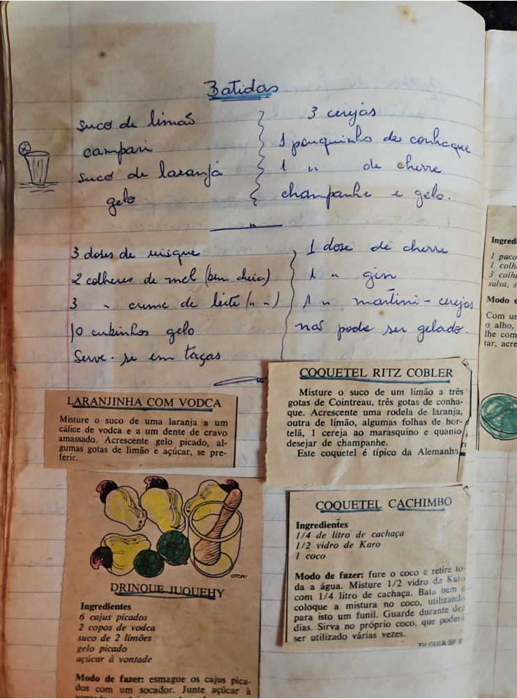

# Página 49
:::danger[NÃO REVISADO]
A página não foi revisada, portanto pode conter erros de digitação, formatação ou alucinações.
:::
## Batidas

*   suco de limão
*   campari
*   suco de laranja
*   gelo
    *   3 cerejas
    *   1 pouquinho de conhaque
    *   1 " de chevre
    *   champanhe e gelo

---

*   3 doses de wisque
*   2 colheres de mel (bem cheia)
*   3 " - creme de leite (frio)
*   10 cubinhos gelo
    *   1 dose de chevre
    *   1 " gin
    *   1 " martini - cerejas
    *   não pode ser gelado.

Serve-se em taças

---

## LARANJINHA COM VODCA

Misture o suco de uma laranja a um cálice de vodca e a um dente de cravo amassado. Acrescente gelo picado, algumas gotas de limão e açúcar, se preferir.

---

## DRINQUE JUQUEHY

### Ingredientes

*   6 cajus picados
*   2 copos de vodca
*   suco de 2 limões
*   gelo picado
*   açúcar à vontade

### Modo de fazer:

esmagu os cajus picados com um socador. Junte açúcar à

---

## COQUETEL RITZ COBLER

Misture o suco de um limão a três gotas de Cointreau, três gotas de conhaque. Acrescente uma rodela de laranja, outra de limão, algumas folhas de hortelã, 1 cereja ao marasquino e quanto desejar de champanhe.
Este coquetel é típico da Alemanha.

---

## COQUETEL CACHIMBO

### Ingredientes

*   1/4 de litro de cachaça
*   1/2 vidro de Karo
*   1 coco

### Modo de fazer:

fure o coco e retire toda a água. Misture 1/2 vidro de Karo com 1/4 litro de cachaça. Bata bem e coloque a mistura no coco, utilizando para isto um funil. Guarde durante dez dias. Sirva no próprio coco, que poderá ser utilizado várias vezes.

