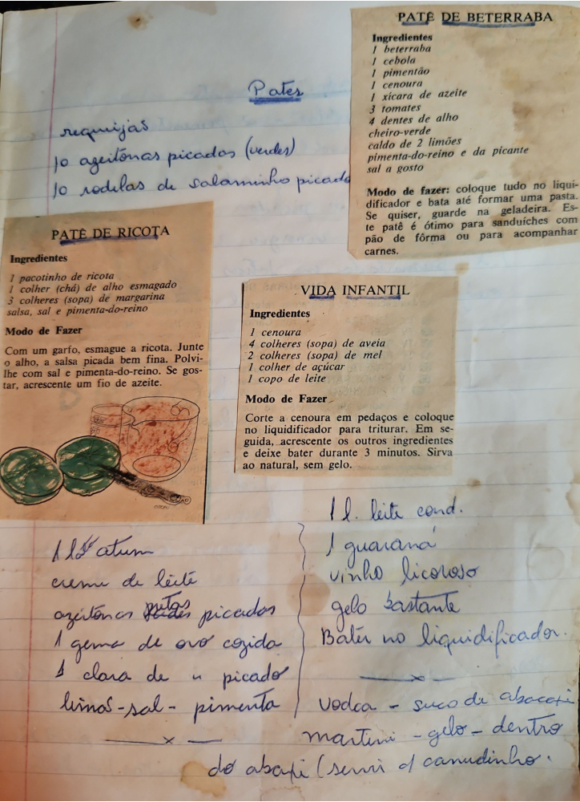

# Página 50
:::danger[NÃO REVISADO]
A página não foi revisada, portanto pode conter erros de digitação, formatação ou alucinações.
:::
## Patês

requijias
10 azeitonas picados (verdes)
10 rodilas de salaminho picado

## PATÊ DE BETERRABA

### Ingredientes

- 1 beterraba
- 1 cebola
- 1 pimentão
- 1 cenoura
- 1 xícara de azeite
- 3 tomates
- 4 dentes de alho
- cheiro-verde
- caldo de 2 limões
- pimenta-do-reino e da picante
- sal a gosto

### Modo de fazer

coloque tudo no liquidificador e bata até formar uma pasta. Se quiser, guarde na geladeira. Este patê é ótimo para sanduiches com pão de fôrma ou para acompanhar carnes.

## PATÊ DE RICOTA

### Ingredientes

- 1 pacotinho de ricota
- 1 colher (chá) de alho esmagado
- 3 colheres (sopa) de margarina
- salsa, sal e pimenta-do-reino

### Modo de Fazer

Com um garfo, esmague a ricota. Junte o alho, a salsa picada bem fina. Polvilhe com sal e pimenta-do-reino. Se gostar, acrescente um fio de azeite.

## VIDA INFANTIL

### Ingredientes

- 1 cenoura
- 4 colheres (sopa) de aveia
- 2 colheres (sopa) de mel
- 1 colher de açúcar
- 1 copo de leite

### Modo de Fazer

Corte a cenoura em pedaços e coloque no liquidificador para triturar. Em seguida, acrescente os outros ingredientes e deixe bater durante 3 minutos. Sirva ao natural, sem gelo.

---

- 1 lata de atum
- creme de leite
- azeitonas fatias picadas
- 1 gema de ovo cozida
- 1 clara de ovo picado
- limão-sal-pimenta

---

- 1 l. leite cond.
- 1 guaraná
- vinho licoroso
- gelo bastante
- Bater no liquidificador.

---

- Vodca - suco de abacati
- martini - gelo - dentro
- do abacaxi (servir c/ canudinho.)

