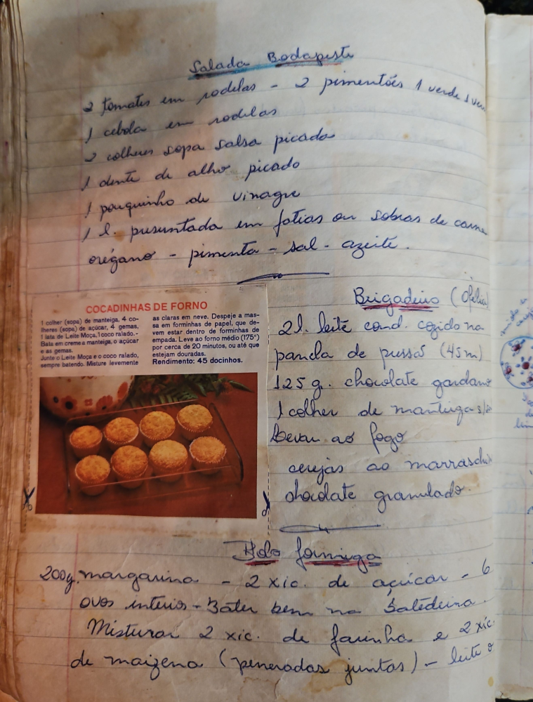

# Página 51
:::danger[NÃO REVISADO]
A página não foi revisada, portanto pode conter erros de digitação, formatação ou alucinações.
:::
## Salada Budapeste

- 2 tomates em rodelas - 2 pimentões 1 verde 1 verm...
- 1 cebola em rodelas
- 2 colher sopa salsa picada
- 1 dente de alho picado
- 1 pouquinho de vinagre
- 1 l. presuntada em fatias ou sobras de carne
- orégano - pimenta - sal - azeite

## COCADINHAS DE FORNO

1 colher (sopa) de manteiga, 4 co-
lheres (sopa) de açúcar, 4 gemas,
1 lata de Leite Moça, 1 coco ralado.-
Bata em creme a manteiga, o açúcar
e as gemas.
Junte o Leite Moça e o coco ralado,
sempre batendo. Misture levemente
as claras em neve. Despeje a mas-
sa em forminhas de papel, que de-
vem estar dentro de forminhas de
empada. Leve ao forno médio (175°)
por cerca de 20 minutos, ou até que
estejam douradas.
Rendimento: 45 docinhos.

## Brigadeiro (Orelh...)

- 2l. leite cond. cozido na
- panela de pressão (45m)
- 125 g. chocolate gardana
- 1 colher de manteiga s/s
- Levar ao fogo
- cerejas ao marraschi...
- chocolate granulado.

## Bolo formiga

- 200g. margarina - 2 xic. de açúcar - 6
- ovos inteiros - Bater bem na batedeira.
- Misturar 2 xic. de farinha e 2 xic.
- de maizena (peneiradas juntas) - leite o...

