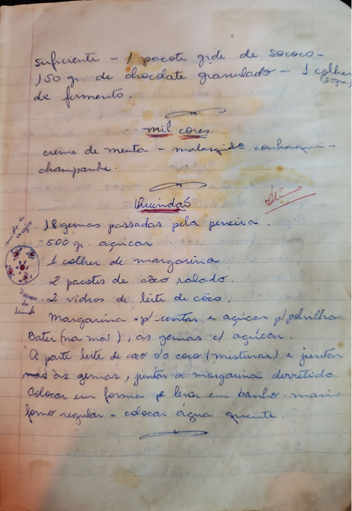

# Página 52
:::danger[NÃO REVISADO]
A página não foi revisada, portanto pode conter erros de digitação, formatação ou alucinações.
:::
suficiente - 1 pacote grde de sococo -
150 gr. de chocolate granulado - 1 colher (sopa)
de fermento.

## mil cores
creme de menta - malarvida conhacque -
champanhe.

## Quindas

### Ingredientes:
*   18 gemas passadas pela peneira.
*   500 gr. açucar
*   1 colher de margarina
*   2 pacotes de cão rolado.
*   2 vidros de leite de côco.
*   Margarina pl untar e açucar pl polvilhar

### Modo de Preparo:
*   Bater (na mos), as gemas cl açucar.
*   A parte leite de cão d/o côco (misturar) e juntar
*   mas as gemas, juntar a margarina derretida
*   Colocar em forma pl levar em banho - maria
*   forno regular - colocar agua quente.

