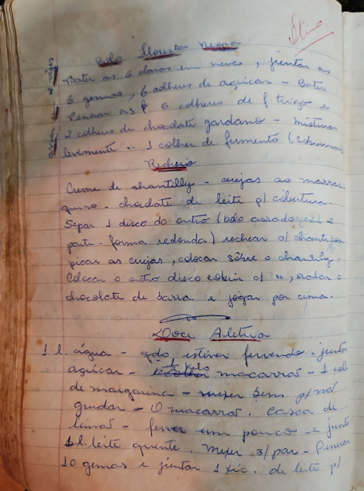

# Página 53
:::danger[NÃO REVISADO]
A página não foi revisada, portanto pode conter erros de digitação, formatação ou alucinações.
:::
## Bolo Floresta Negra

- Bater as 6 claras em neve, juntar as
- 6 gemas, 6 colheres de açúcar - Bater
- juntar as 6 colheres de f. trigo e
- 2 colheres de chocolate gardano - misturar
- livremente... 1 colher de fermento (Richmann)

### Recheio

- Creme de chantilly - cerejas ao marrar
- queiro - chocolate de leite p/ cobertura
- Separar 1 disco do outro (bolo assado, p/ dividir 2
- parte - forma redonda) rechear c/ chantilly
- picar as cerejas, colocar sobre o chantilly.
- Colocar o outro disco cobrir c/ m, ralar o
- chocolate de barra e jogar por cima.

## Doce Aletria

- 1 l. água - qdo estiver fervendo - juntar
- açúcar - 1/2 kilo - Colher macarrão - 1 coll
- de margarina - mexer bem p/ não
- grudar - O macarrão. Casca de
- limas - ferver um pouco e junto
- 1 l. leite quente. Mexer s/ parar - peneirar
- 10 gemas e juntar 1 xc. de leite p/

