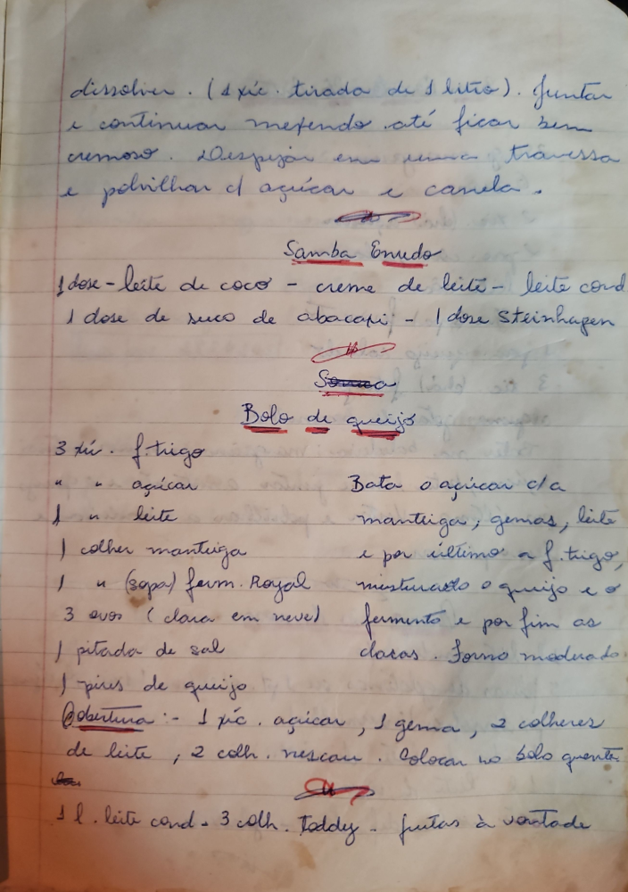

# Página 54
:::danger[NÃO REVISADO]
A página não foi revisada, portanto pode conter erros de digitação, formatação ou alucinações.
:::
## [Continuação de receita anterior]

dissolver. (4 xic. tiradas de 1 litro). Juntar e continuar mexendo até ficar bem cremoso. Despejar em uma travessa e polvilhar c[om] açúcar e canela.

## Samba Enxuto

- 1 dose - leite de coco
- creme de leite
- leite cond[ensado]
- 1 dose de suco de abacaxi
- 1 dose Steinhagen

## Bolo de queijo

- 3 xic. f[arinha de] trigo
- " " " açúcar
- 1 " leite
- 1 colher manteiga
- 1 " (sopa) f[arinha] Royal
- 3 ovos (clara em neve)
- 1 pitada de sal
- 1 pires de queijo

Bate o açúcar c/[om] a manteiga; gemas, leite e por último a f[arinha de] trigo, misturado o queijo e o fermento e por fim as claras. Forno moderado.

### Cobertura

- 1 xic. açúcar, 1 gema, 2 colheres de leite, 2 colh. nescau. Colocar no bolo quente.

## [Mistura]

- 1 l. leite cond[ensado]
- 3 colh. Toddy
- frutas à vontade

