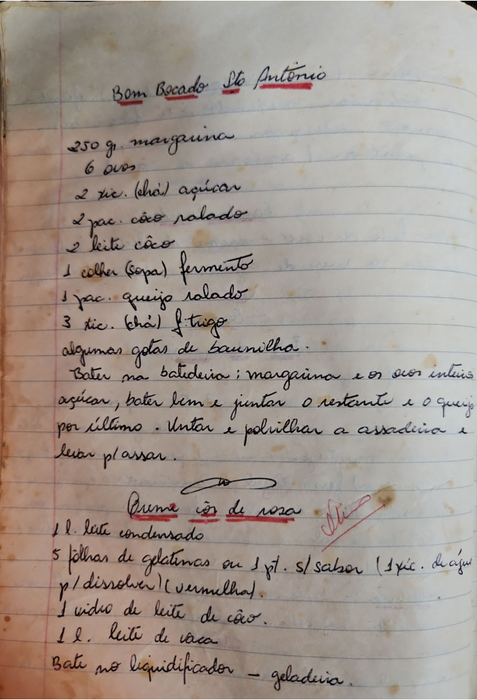

# Página 55
:::danger[NÃO REVISADO]
A página não foi revisada, portanto pode conter erros de digitação, formatação ou alucinações.
:::
## Bom Bocado Sto Antônio

*   250 g. margarina
*   6 ovos
*   2 xíc. (chá) açúcar
*   2 pac. côco ralado
*   2 leite côco
*   1 colher (sopa) fermento
*   1 pac. queijo ralado
*   3 xíc. (chá) f. trigo
*   algumas gotas de baunilha.

Bater na batedeira: margarina e os ovos inteiros açúcar, bater bem e juntar o restante e o queijo por último. Untar e polvilhar a assadeira e levar p/ assar.

## Creme côco de rosa

*   1 l. leite condensado
*   5 folhas de gelatinas ou 1 pct. s/ sabor (1 xíc. de água p/ dissolver) (vermelha).
*   1 vidro de leite de côco.
*   1 l. leite de vaca

Bate no liquidificador - geladeira.

