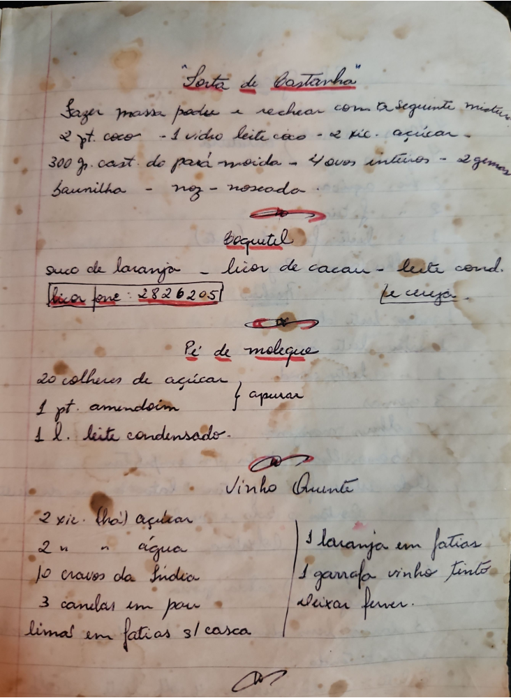

# Página 56
:::danger[NÃO REVISADO]
A página não foi revisada, portanto pode conter erros de digitação, formatação ou alucinações.
:::
## Torta de Castanha

Fazer massa padeu e rechear com a seguinte mistura:
- 2 pt. coco
- 1 vidro leite de coco
- 2 xc. açucar
- 300 g. cast. do pará moída
- 4 ovos inteiros
- 2 gemas
- baunilha
- noz-moscada

## Coquetel

- suco de laranja
- licor de cacau
- leite cond.

bica fone: [2826205]

## Pé de moleque

- 20 colheres de açucar } apurar
- 1 pt. amendoim
- 1 L. leite condensado.

## Vinho Quente

- 2 xc. (chá) açucar
- 2 " " água
- 10 cravos da India
- 3 canelas em pau
- limas em fatias s/ casca

- 1 laranja em fatias
- 1 garrafa vinho tinto
- deixar ferver.

