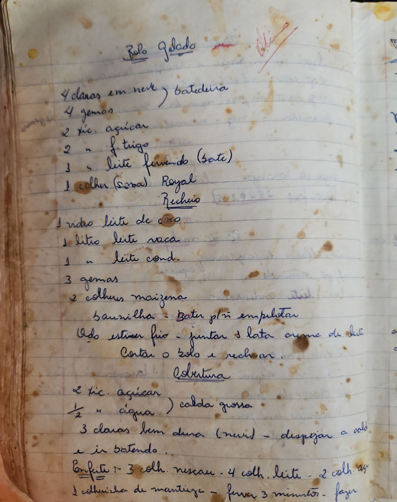

# Página 57
:::danger[NÃO REVISADO]
A página não foi revisada, portanto pode conter erros de digitação, formatação ou alucinações.
:::
## Bolo Gelado

- 4 claras em neve ) batedeira
- 4 gemas
- 2 xic. açicar
- 2 " f. trigo
- 1 " leite fervendo (bate)
- 1 colher (Sopa) Royal

### Recheio

- 1 vidro leite de coco
- 1 litro leite vaca
- 1 " leite cond.
- 3 gemas
- 2 colhers maizena
- baunilha - Bater p/ ñ empelotar
- Qdo estiver frio - juntar 1 lata creme de leite
- Cortar o bolo e rechear.

### Cobertura

- 2 xic. açicar
- ½ " agua ) calda grossa
- 3 claras bem dura (neve) - despejar a calda e ir batendo.

### Confite

- Confite:- 3 colh. nescau - 4 colh. leite - 2 colh. açicar
- 1 colhercha de mantiga - ferver 3 minutos - fazer

