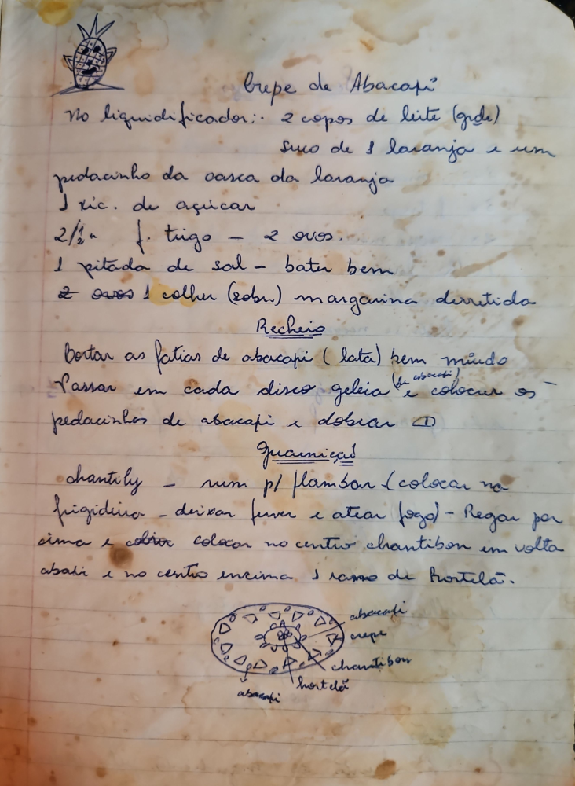

# Página 58
:::danger[NÃO REVISADO]
A página não foi revisada, portanto pode conter erros de digitação, formatação ou alucinações.
:::
## Crepe de Abacaxi

No liquidificador::
- 2 copos de leite (gde)
- suco de 1 laranja e um
- pedacinho da casca da laranja
- 1 xic. de açucar
- 2½ xic. f. trigo - 2 ovos.
- 1 pitada de sal - bater bem
- 2 ovos 1 colher (sopa) margarina derretida

### Recheio
- Cortar as fatias de abacaxi (lata) bem miudo
- Passar em cada disco geleia (de abacaxi) e colocar os pedacinhos de abacaxi e dobrar

### Guarnição
- chantily - num para flambar (colocar na
- frigideira - deixar ferver e atear fogo) - Regar por
- cima e cobrir colocar no centro chantibon em volta
- abacaxi e no centro em cima 1 ramo de hortelã.

Drawing Labels:
- abacaxi
- crepe
- chantibon
- hortelã
- abacaxi

