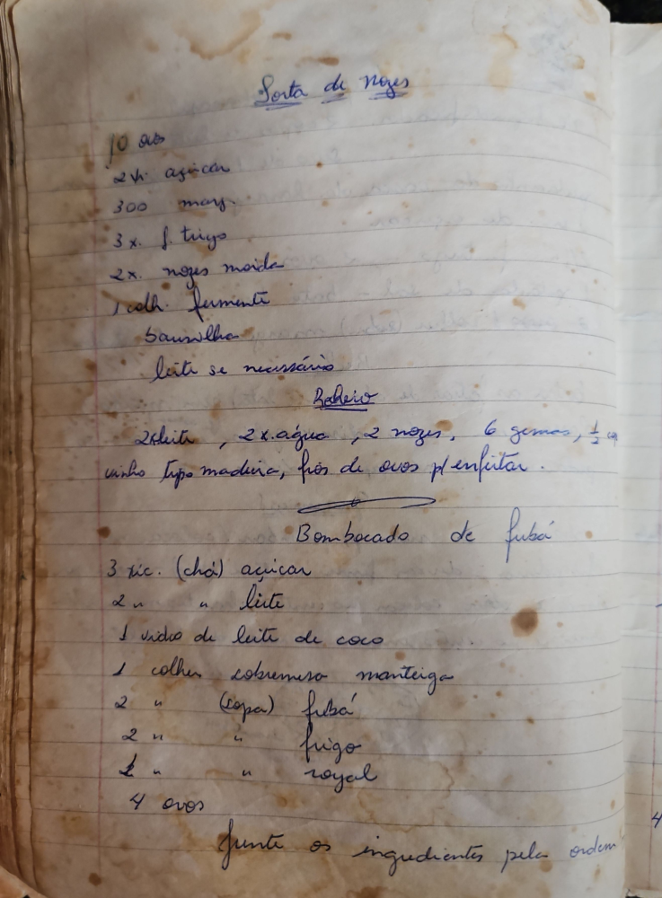

# Página 59
:::danger[NÃO REVISADO]
A página não foi revisada, portanto pode conter erros de digitação, formatação ou alucinações.
:::
## Sopa de nozes

- 10 ovos
- 2x açucar
- 300 marg.
- 3x f. trigo
- 2x. nozes moida
- 1colh. fermento
- Saunilha
- leite se necessario

### Baheiro

- 2 leite, 2x. água, 2 nozes, 6 gemas, ¹/² cp. vinho tipo madeira, fios de ovos p/ enfeitar.

## Bombocado de fubá

- 3 xic. (chá) açucar
- 2 " " leite
- 1 vidro de leite de coco
- 1 colher sobremesa manteiga
- 2 " (Copa) fubá
- 2 " " trigo
- 1 " " royal
- 4 ovos

junte os ingredientes pela ordem

