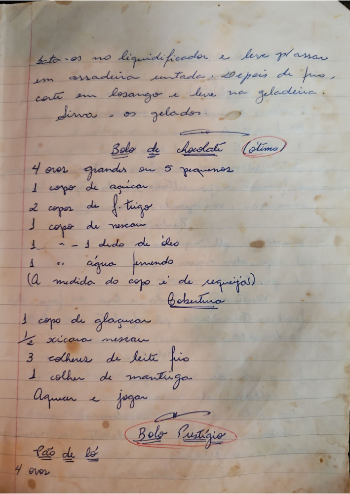

# Página 60
:::danger[NÃO REVISADO]
A página não foi revisada, portanto pode conter erros de digitação, formatação ou alucinações.
:::
bata-os no liquidificador e leve para passar em assadeira untada. Depois de frio, corte em losango e leve na geladeira. Sirva-os gelados.

## Bolo de Chocolate (ótimo)

*   4 ovos grandes ou 5 pequenos
*   1 copo de açucar
*   2 copos de f. trigo
*   1 copo de nescau
*   1 n. - 1 dedo de óleo
*   1 " água fervendo

(A medida do copo é de requeijão).

### Cobertura

*   1 copo de glaçucar
*   ½ xicara nescau
*   3 colheres de leite frio
*   1 colher de manteiga

Aquecer e jogar.

## Bolo Prestígio

## Pão de ló

*   4 ovos

