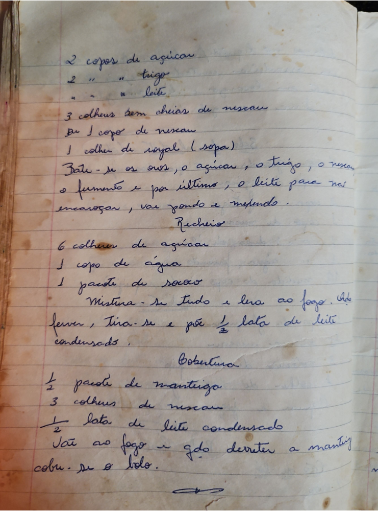

# Página 61
:::danger[NÃO REVISADO]
A página não foi revisada, portanto pode conter erros de digitação, formatação ou alucinações.
:::
- 2 copos de açucar
- 2 copos de trigo
- 2 copos de leite
- 3 colheres bem cheias de nescau
- ou 1 copo de nescau
- 1 colher de royal (sopa)
- Bate-se os ovos, o açucar, o trigo, o nescau o fermento e por ultimo, o leite para nao encaroçar, vai pondo e mexendo.

## Recheio

- 6 colheres de açucar
- 1 copo de agua
- 1 pacote de socao
- Mistura-se tudo e leva ao fogo. Pode ferver, tira-se e põe ¹/₂ lata de leite condensado.

## Cobertura

- ¹/₂ pacote de mantiga
- 3 colheres de nescau
- ¹/₂ lata de leite condensado
- Vai ao fogo e qdo derreter a mantiga cobre-se o bolo.

