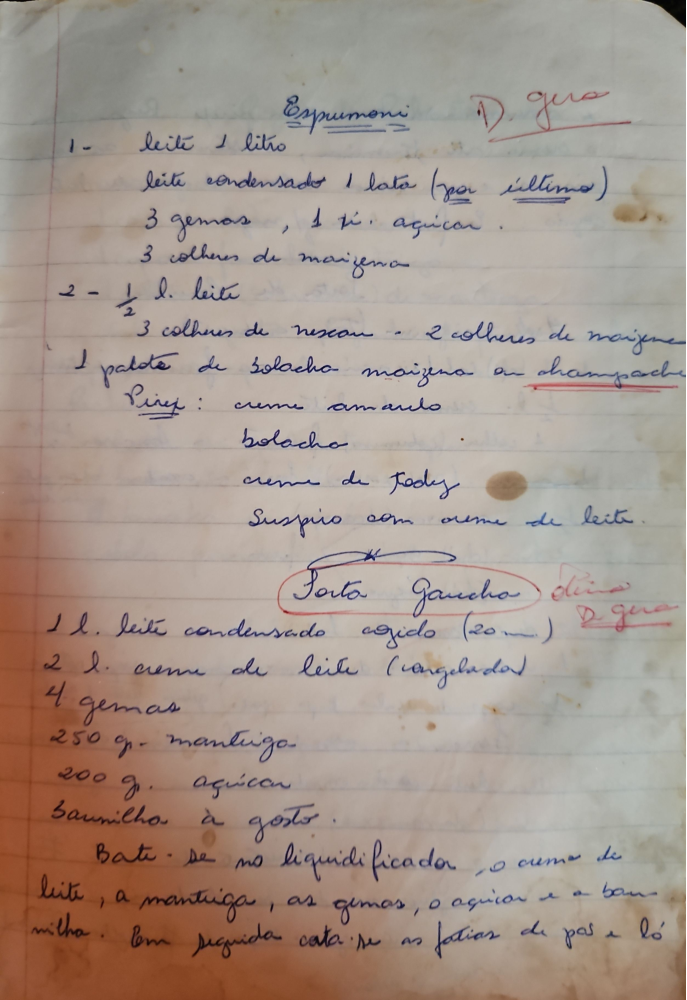

# Página 62
:::danger[NÃO REVISADO]
A página não foi revisada, portanto pode conter erros de digitação, formatação ou alucinações.
:::
## Espumoni D. Gera

1-
- leite 1 litro
- leite condensado 1 lata (por ultimo)
- 3 gemas, 1 xic. açucar.
- 3 colheres de maizena

2-
- 1/2 l. leite
- 3 colheres de nescau - 2 colheres de maizena

- 1 pacote de bolacha maizena ou champanhe
- Pirez:
    - creme amarelo
    - bolacha
    - creme de Fady
    - Suspiro com creme de leite.

## Torta Gaúcha Dina D. Gera

- 1 l. leite condensado cozido (20 m.)
- 2 l. creme de leite (congelados)
- 4 gemas
- 250 gr. mantiga
- 200 gr. açucar
- Baunilha a gosto.

Bate-se no liquidificador, o creme de
leite, a mantiga, as gemas, o açucar e a bau-
nilha. Em seguida cata-se as fatias de pao e bó

