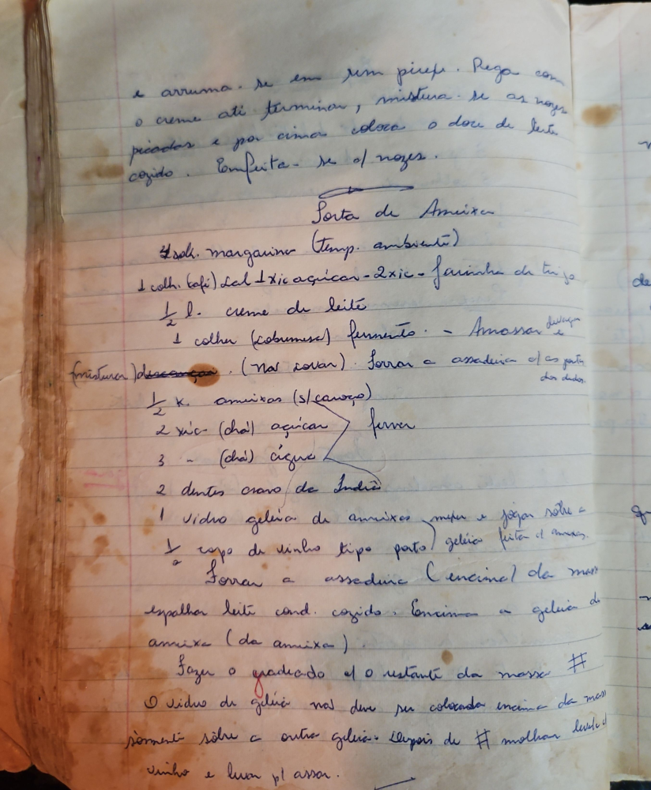

# Página 63
:::danger[NÃO REVISADO]
A página não foi revisada, portanto pode conter erros de digitação, formatação ou alucinações.
:::
e arruma-se em pirex. Rega com o creme até terminar, mistura-se as nozes picadas e por cima coloca o doce de leite cozido. Enfeita-se c/ nozes.

## Torta de Ameixa

**Ingredientes:**

- 400g. margarina (Temp. ambiente)
- 1 colh. (café) Sal
- 1 Xic açucar
- 2 xic. farinha de trigo
- ½ dl. creme de leite
- 1 colher (sobremesa) fermento.

**Preparo da Massa:**

1.  Amassar e descansar. (Não sovar).
2.  Forrar a assadeira c/ a parte dos dedos.
    *(Nota: Sovar a assadeira (c/ enzima) da massa)*

**Recheio de Ameixa:**

**Ingredientes:**

- ½ K. ameixas (s/ caroço)
- 2 xic. (chá) açucar
- 3 - (chá) água
- 2 dentes cravo de Índia

**Preparo do Recheio:**

1.  Ferver os ingredientes do recheio.

**Cobertura de Geléia:**

**Ingredientes:**

- 1 Vidro geléia de ameixa
- ½ copo de vinho tipo porto

**Preparo da Cobertura:**

1.  Mexer e jogar sobre a geléia feita c/ ameixa (o recheio cozido).

**Montagem:**

1.  Espalhar leite cond. cozido.
2.  Espalhar geléia de ameixa (da ameixa) (o recheio cozido).
3.  Espalhar a cobertura de geléia com vinho.
4.  Fazer o quadrado c/ o restante da massa #

**Notas:**

- O vidro de geléia não deve ser colocada encima da massa sómente sobre a outra geléia (o recheio cozido).
- Depois de fazer o quadrado (#) molhar e levar p/ assar.

