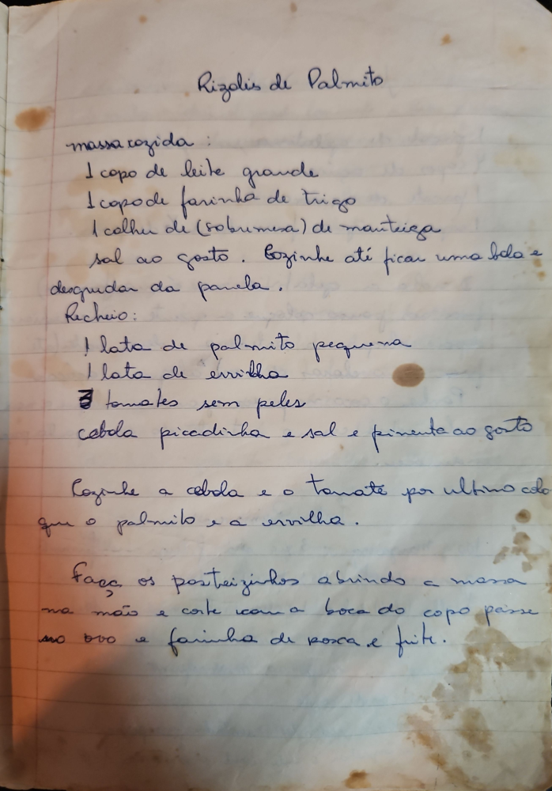

# Página 64
:::danger[NÃO REVISADO]
A página não foi revisada, portanto pode conter erros de digitação, formatação ou alucinações.
:::
## Rizolis de Palmito

### Massa cozida:
*   1 copo de leite grande
*   1 copo de farinha de trigo
*   1 colher de (sobremesa) de manteiga
*   sal ao gosto
*   Cozinhe até ficar uma bola e desgrudar da panela.

### Recheio:
*   1 lata de palmito pequena
*   1 lata de ervilha
*   3 tomates sem peles
*   cebola picadinha e sal e pimenta ao gosto

*   Cozinhe a cebola e o tomate por ultimo coloque o palmito e a ervilha.
*   Faça os pasteizinhos abrindo a massa na mão e corte com a boca do copo passe no ovo e farinha de rosca e frite.

