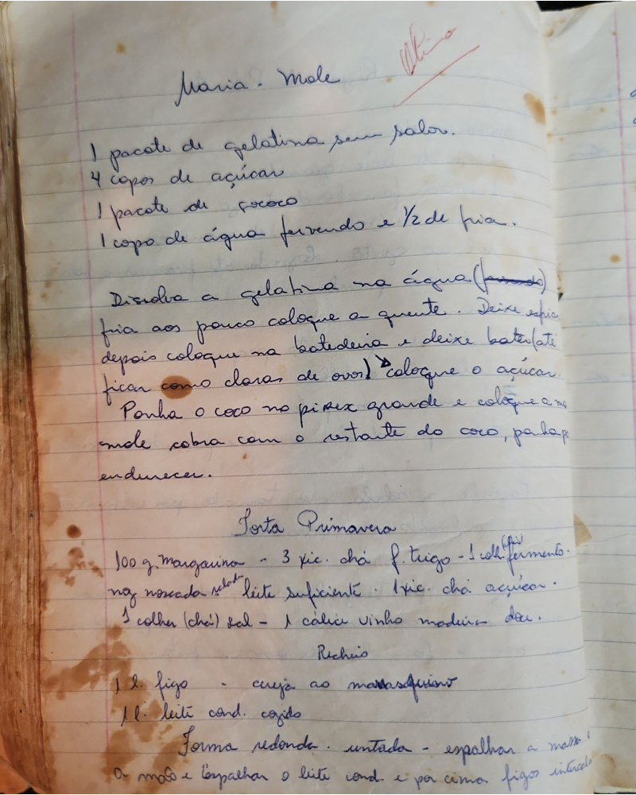

# Página 65
:::danger[NÃO REVISADO]
A página não foi revisada, portanto pode conter erros de digitação, formatação ou alucinações.
:::
## Maria? Mole

*   1 pacote de gelatina sem sabor.
*   4 copos de açúcar
*   1 pacote de côco
*   1 copo de água fervendo e ½ de fria.

Dissolva a gelatina na água (fria).
fria aos poucos coloque a quente. Deixe esfria
depois coloque na batedeira e deixe bater (ate)
ficar como claras de ovos), coloque o açúcar.
Ponha o côco no pirex grande e coloque a mas
mole cubra com o restante do côco, para p
endurecer.

## Torta Primavera

*   100 g. margarina - 3 xic. chá f. trigo - 1 colher fermento.
*   noz moscada ralada - leite suficiente. 1 xic. chá açúcar.
*   1 colher (chá) sal - 1 cálice vinho madeira doc.

### Recheio

*   1 kg. figo - cereja ao marasquino
*   1 l. leite cond. cozido

Forma redonda. untada - espalhar a massa
a massa e espalhar o leite cond. e por cima. figos inteiros

