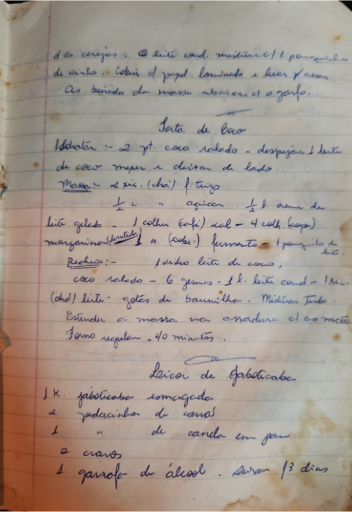

# Página 66
:::danger[NÃO REVISADO]
A página não foi revisada, portanto pode conter erros de digitação, formatação ou alucinações.
:::
## Torta de Coco

Hidratar:
* 2 pt. coco ralado
* Despejar 1 lata de coco mexer e deixar de lado.

Massa:
* 2 xic. (chá) f. trigo
* ½ xic. açucar
* ½ l. creme de leite gelado
* 1 colher (café) sal
* 4 colh. (sopa) margarina (derretida)
* 1 x (café) fermento
* 1 ponhadinho de leite.

### Recheio:
* 1 vidro leite de coco,
* Coco ralado
* 6 gemas
* 1 l. leite cond.
* 1 xic. (chá) leite
* gotas de baunilha.

Misturar tudo.

Estender a massa na assadeira c/ as mãos
Forno regular - 40 minutos.

---

## Licor de Jabuticaba

* 1 K. jabuticaba esmagada
* 2 pedacinhos de canela
* 1 " de canela em pó
* 2 cravos
* 1 garrafa de álcool. Deixar 13 dias.

