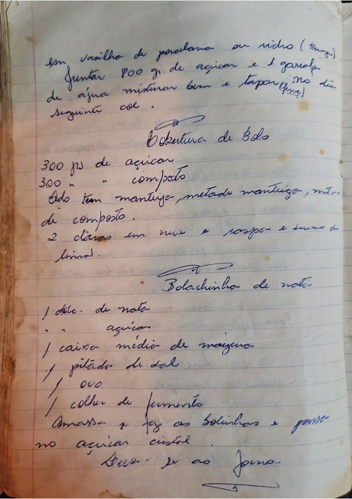

# Página 67
:::danger[NÃO REVISADO]
A página não foi revisada, portanto pode conter erros de digitação, formatação ou alucinações.
:::
## Preparação de Base
- Em vasilha de porcelana ou vidro (Tampa)
- Juntar 800 gr. de açucar e 1 garrafa de agua
- misturar bem e Tapar no dia seguinte col.

## Cobertura de Bôlos
- 300 grs de açucar
- 300 grs de compôto
- Onde tem mantiega, metade mantiega, metade de compôsto.
- 2 claras em neve e raspa e sumo de limão.

## Bolachinho de notas
- 1 dlc. de nata
- açucar
- 1 caixa média de maizena
- 1 pitado de sal
- 1 ovo
- 1 colher de fermento
- Amassa e faz as bolinhos e passa no açucar cristal .
- Leve se ao forno.

