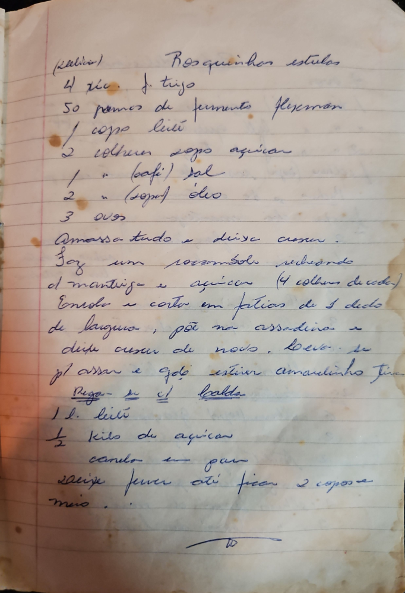

# Página 68
:::danger[NÃO REVISADO]
A página não foi revisada, portanto pode conter erros de digitação, formatação ou alucinações.
:::
## Rosquinhas estufas

(Medida)

*   4 xic. de trigo
*   50 gramas de fermento Fleischman
*   1 copo leite
*   2 colheres sopa açucar
*   1 " (café) sal
*   2 " (sopa) óleo
*   3 ovos

Amassa tudo e deixe crescer.
Faz um rocambole recheando de mantiga e açucar (4 colheres de cada).
Enrola e cortar em fatias de 1 dedo de largura, põe na assadeira e deixe crescer de novo. Leva-se p/ assar e qdo estive amadinho tira.

Regas-se c/ calda

*   1 l. leite
*   ½ kilo de açucar
*   canela em pó

saixe ferver ate ficar 2 copos e mais.

