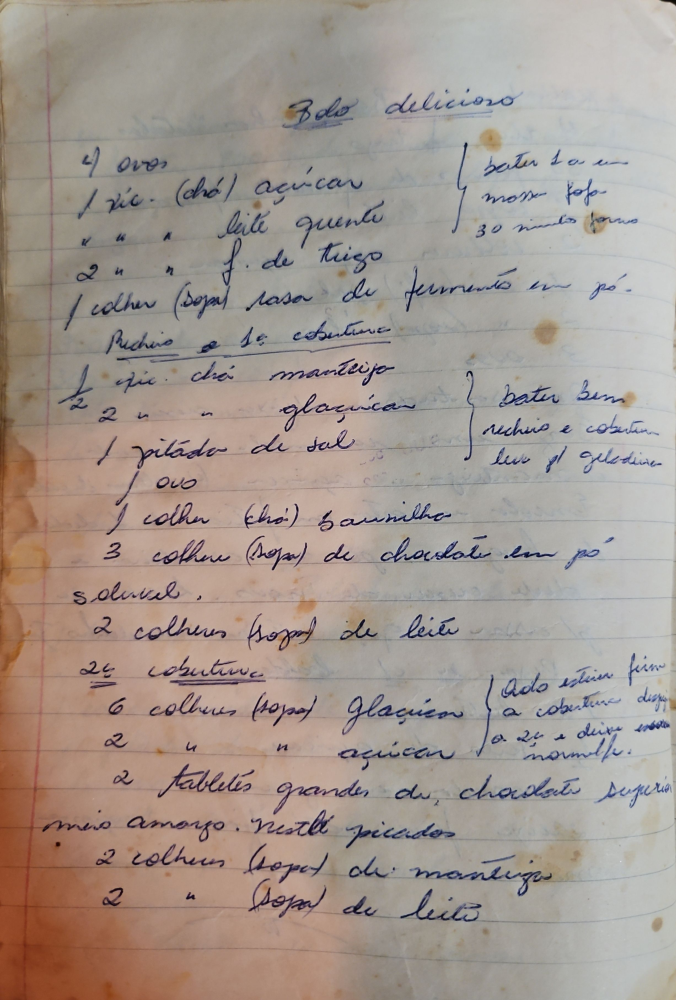

# Página 69
:::danger[NÃO REVISADO]
A página não foi revisada, portanto pode conter erros de digitação, formatação ou alucinações.
:::
## Bolo delicioso

- 4 ovos
- 1 xic. (chá) açúcar
- leite quente
- 2 " " f. de trigo
- 1 colher (sopa) rasa de fermento em pó.

bater tudo em uma fôrma.
30 minutos forno

### Recheio e cobertura

- ½ xic. chá manteiga
- 2 " " glaçucar
- 1 pitada de sal
- 1 ovo
- 1 colher (chá) baunilha
- 3 colher (sopa) de chocolate em pó solúvel.
- 2 colheres (sopa) de leite

bater bem
recheio e cobertura
leva p/ geladeira

### Cobertura

- 6 colheres (sopa) Glaçucar
- 2 " " " açúcar
- 2 tabletes grandes de chocolate Superior meio amargo. Nestlé picados
- 2 colheres (sopa) de manteiga
- 2 " " (sopa) de leite

isto estando firme
a cobertura dispõe sobre o bolo e deixa escorrer naturalmente.

